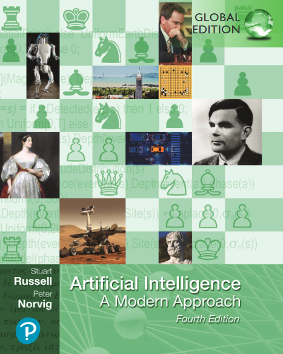

这个文件夹放的是 #读书笔记
- 封面
- 书名：Artificial Intelligence --- A Modern Approach, 4e
- ISBN：9781292401171

内容
- 总体来说是人工智能方面的综述。对炼丹人不一定很有用，因为太多Good Old-Fashioned AI了
- 新版有很多新时代内容（比如更多ML内容）
- agent
> receive percepts from the environment and perform actions

不就是个函数？
- 本书中，重要概念加粗且首次出现时侧边加notes