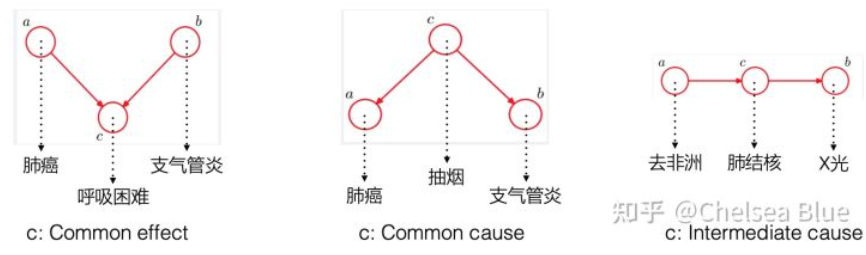

## 12.1 Acting under Uncertainty
- Uncertainty来源：partial observability, nondeterminism, adversaries
- [[3-search]], [[6-adversarial-search]], [[7-logical-agents]]用contingency plan处理一切情况
- 缺点：太庞大，事无巨细，没法比较无法guarantee的情况
  - 无法处理logic的“不绝对”（qualification problem）
  - 没法灵活处理[[2-intelligent-agents]]提到的“performance measure”
- 没有不确定性的失败原因
  - laziness: 没有“其它情况”“口袋罪”
  - theoretical ignorance: 理论本来就没法完全精确
  - practical ignorance: 太多$\vee$，实际没法跑
- 使用degree of belief，回忆[[8-FOL]]，ontology一样（各facts），epistemology不一样（不是非黑即白）
  - “不到1”的那些可以处理laziness, ignorance等
- `probability statements are made with respect to a knowledge state, not with respect to the real world`，是说“针对现在知道的KB状态，认为概率多少”，所以调整概率并不矛盾（KB不同了）
- 合理performance标准：需要针对factored结果给出偏好
  - utility theory
  - utility对一局游戏中不同人不同，对一般情况下每个人也不同，不同偏好间我们不认为“谁更理性”
  - utility可以包含利他
- decision theory: prob + utility
  - 参考[[statistical-decision]]，[[bayesian-inference]]
    - 其中有action，decision rule等词
  - 最大化效用期望（MEU）
  - DT-AGENT：注意要实时更新自己认为的概率分布（参考[[bayesian-inference]]）
## 12.2 Basic Probability Notation
- 参考[[7-logical-agents]]，那里的句子把世界分成非黑即白，现在只是认为什么世界比较可能
  - mutually exclusive and exhaustive: 恰好一个成立
  - 所有世界集合$\Omega$，一个世界$\omega$
- 概率模型：$P(\omega)$，给世界指定概率。每个数值$0\le P(\omega)\le 1$，总和为1
  - 严格的[[axiom]]（有连续的）其实在AI没啥必要。我们现在知道这个就行了
  - events/proposition：差不多是一个意思。世界的集合
  - events的概率就是世界概率的和
  - 可能宣称一个events的概率是多少，不具体确定world
- 先验：没有任何已知信息，给出概率
  - 后验：given evidence，给出调整后的估计
- 区别于逻辑：这个后验表示知道……，但不知道别的时的概率
- $P(a|b)=P(a\wedge b)/P(b)$
  - 也可以移项成积
- 表达命题：factored, [[5-constraint-satisfaction]]
- 随机变量：把$\Omega$映射到（往往数值）的值域
  - 值域$\{0,1\}$：布尔随机变量，伯努利
  - $A=true$可以用小写$a$表示
  - 一般值域的随机变量：如$Weather=sunny$可以用$sunny$表示
  - 值域为数的，可以不等式
  - 还能逻辑表达式
- 多个条件可以用$\wedge$或$,$表示
- 值域有限：“概率分布”，categorical distribution
- 值域是区间：简单看概率分布可能改为看概率密度**pdf**
  - 直观定义$P(x)=lim_{dx\to 0} P(x\le X\le x+dx)/dx$（这里密度也用大写$P$感觉不是太好）
    - 于是用加粗**P**表示两种情况都可能（很多公式是共同的）
    - 密度有单位
  - `The probability that NoonTemp is exactly 20.18C is zero, because 20.18C is a region of width 0`
- 多个变量：联合分布
- 记号方便：如$Weather$有4种可能，$Cavity$有2种，则可以$P(W,C)=P(W|C)P(C)$表示共8条公式
- 此处类似[[7-logical-agents]]，认为一个world就是对所有随机变量都赋值
  - 回忆布尔随机变量就是命题
  - 回忆[[7-logical-agents]]中world就是以一定手段对所有命题都赋值
  - 显然满足存在唯一性
  - 可以计算命题的真值
  - 有时无谓增多随机变量无必要，只会让“包起来的碰撞箱”增大而实际有用的世界个数不增大
  - probability model可以由联合分布确定
- 由之前的概率公理
  - 可以推出并交补等概率关系
  - 当然本书公理系统和通用的Kolmogorov公理系统不相同。Kolmogorov考虑并的概率
- 有没有可能出现违反$P(a\vee b)=P(a)+P(b)-P(a\wedge b)$的信念？
  - 如果有，另一个人可以和他打赌使他输得彻底（无论现实概率如何）
  - 注：这和估计概率不准导致赌输本质不同
  - 即Finetti: 理性agent不会这样
  - 反驳：不打赌呢？再反驳：打赌是在决策过程中无法避免的隐式行为（即使inaction），除非时间不流动否则不能不打赌
- 满足一些性质（如无矛盾，对应一般的逻辑，传递性等），则前述“概率”是唯一可能的建模方法
- `however, practical demonstrations sometimes speak louder than proofs. The success of reasoning systems based on probability theory has been much more effective than philosophical arguments in making convert`
## 12.3 Inference Using Full Joint Distributions
- 计算query命题后验（参考[[bayesian-inference]]）
- full joint distribution就是一开始KB
- 边缘概率分布：加起表中一行/一列
  - 名字来源：margins of insurance tables
  - $P(Y)=\sum_z P(Y,Z=z)$，要对所有可能$z$求和
  - 简化记号并使用条件概率定义得到全概公式（conditioning，分类讨论）$P(Y)=\sum_z P(Y|z)P(z)$
- 把一些条件分布加起来肯定得到1，这时分母像是归一化常数
  - 由此有一些语法糖
  - 大写表示随机变量，小写表示具体取值。所以$P(A|b)$是个二元组
  - $P(A|b)=\alpha P(A,b)=\alpha[P(A,b,c)+P(A,b,\neg c)]$
  - $=\alpha[\langle 0.1, 0.2\rangle +\langle0.1, 0.2\rangle]=\alpha\langle 0.2, 0.4\rangle=\langle0.33, 0.67\rangle$
  - 此时不需要知道归一化常数具体是啥。能提高速度，且能有时计算本来以为不能算的概率
- 于是就有一般规则$P(X|e)=\alpha P(X,e)=\alpha\sum_y P(X,e,y)$
  - $e$是观察到的证据，$y$是不知道的
  - 要对所有可能$y$求和
  - 但效率太低了。所以这一般作为理论基础用于构建更快的系统
  - 类似于[[7-logical-agents]]中以真值表作为更高效系统的依据
## 12.4 Independence
- 举例：牙痛和天气，不同次抛硬币
- 公式表示：$P(cloud|cavity)=P(cloud),P(cloud,cavity)=P(cloud)P(cavity),P(cavity|cloud)=P(cavity)$都行
- 因此可大大减少表中数据个数
- 独立性的实际意义
  - 否则牙医也要会meteorology
- 干净独立性很难找，即使找到也可能有几百个变量拆不开，所以可能需要更复杂的概念
## 12.5 Bayes’ Rule and Its Use
- $P(b|a)=\frac{P(a|b)P(b)}{P(a)}$，是各种“后验”推断的基础
- 语法糖形式$P(Y|X)=\frac{P(X|Y)P(Y)}{P(X)}$
- 增加background evidence形式：$P(Y|X,e)=\frac{P(X|Y,e)P(Y|e)}{P(X|e)}$
- 常见应用：$Y$意为$cause$，$X$意为$effect$，我们从观察到的效果推断可能产生它的原因
  - $P(effect|cause)$：causal direction，反之diagnostic
- 常见例子：a本身概率很小，因为你先验小了，所以即使a导致b概率很大，已知b时的后验的a概率也不大
- 使用归一化常数的版本
  - $P(M|s)=\alpha\langle P(s|m)P(m),P(s|\neg m) P(\neg m) \rangle$
    - 相比$P(s)$需要计算$P(s|\neg m)$
  - $P(Y|X)=\alpha P(X|Y)P(Y)$
- 使用bayes的原因：diagnostic比causal更脆弱（例如出现造成b症状的a的流行病流行）
- 更多evidence怎么办？还是指数爆炸啊？还是有很多$P(e_1,e_2|c)$要算啊
  - 只要conditional independence $P(e_1,e_2|c)=P(e_1|c)P(e_2|c)$即可（不是绝对的independence）
  - `toothache depends on the state of the nerves in the tooth, whereas the probe’s accuracy depends primarily on the dentist’s skill, to which the toothache is irrelevant.`
  - 等价形式$P(X|Y,Z)=P(X|Z),P(Y|X,Z)=P(Y|Z)$
  - 所以合理安排顺序可以更大量地减少存储数字数
    - 参考[[概率图]]
  - 注：本来不独立加了条件也可能独立，但本来独立加了条件可能不独立（当$A\to C, B\to C$时）
    - 直观：已知你长得很高，你爸不高……
- `Conceptually, Cavity separatesSeparation Toothache and Catch because it is a direct cause of both of them`，实际中找条件独立可以从这里入手
- [拓展阅读](https://zhuanlan.zhihu.com/p/397796913)
  - ，用条件独立判断“无（直接）因果”！
## 12.6 Naive Bayes Models
- 全都条件独立！$P(c,e_1,\cdots,e_n)=P(c)\prod_i P(e_i|c)$
- 使用[[概率图]]表示：一因所有果
- `The naive Bayes model is sometimes called a Bayesian classifier, a somewhat careless usage that has prompted true Bayesians to call it the idiot Bayes model.`
- 即使假设不成立也往往很有效
  - `The violation of independence usually means that the final posterior probabilities will be much closer to 1 or 0 than they should be; in other words, the model is overconfi- dent in its predictions`
  - 但分个新闻类别还是靠谱的
- 实际计算：从先验开始，乘一堆条件概率，最后归一化即可
  - 没观察到的那些分量“自然消失”
  - 小心赋予0（可以加一个很小的数，不要随便赋0）
## 12.7 The Wumpus World Revisited
- 需要先验值0.2
  - 对比之前[[7-logical-agents]]，不是简单对逻辑中的模型计数或看是否存在满足某条件的（model checking），而是加总概率
- 注意要假设独立性
- 加的时候只考虑相对值就行了，反正最后都要乘以归一化常数
  - 比如三个坑对应的相对值是$0.2*0.2$，一个坑对应的相对值是$0.8*0.8$