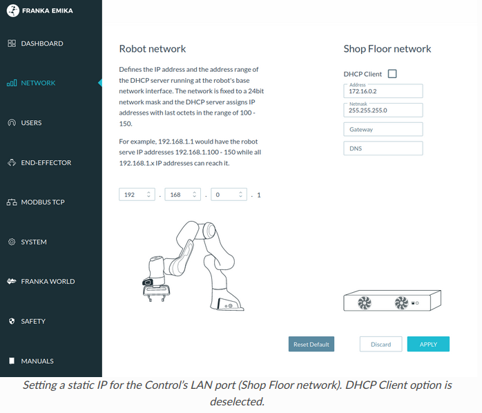
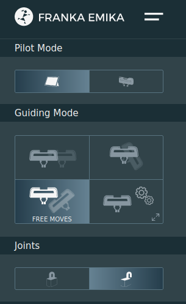

前置
- [[franka-panda/on-off]]启动到黄灯常亮
- 有网口的电脑。需要**直连**电脑和机械臂（如果用转接头等可能会影响速度等，导致不给连接）
  - 机械臂有网口，控制柜也有网口
  - 我们这次先连机械臂网口进行配置，是[[temp-solution]]，此时只能[[control-using-desk]]
  - 如果[[franka-ros]]，需要连[[connect-controller]]

步骤
- 参考[官方文档](https://frankaemika.github.io/docs/getting_started.html)
  - 需要翻墙，比如[[linux]]
- [教程，看第一个视频](https://mp.weixin.qq.com/mp/homepage?__biz=MzI1MDQyMTQ2Mw==&hid=2&sn=b0ae69e54148897202a821d0a48d79e9&scene=1&devicetype=android-29&version=28000653&lang=zh_CN&nettype=3gnet&ascene=7&session_us=gh_8f8e4c6a8bf8&pass_ticket=v3fxJbAjVoDUxQTg9j07UZ1xyvu8oHbx4Mk%2F5beeCBiI87W8PE%2FgLDbCygl6zF0M&wx_header=1&from=groupmessage)，用机械臂网口和`192.168.0.1`登录机械臂
  - 这里提到机械臂地址`192.168.0.1`，所以参考[[wired-connection]]登录上`192.168.0.1`
  - 注意你的代理有没有绕过`192.168.0.1`，参考[[settings-and-configurations]]
  - 
  - 当然，这里的`192.168.0.1`只是默认地址。如果你之前登录过机械臂，手动在这里设置过`Robot network`的ip，那当然就变了
  - 浏览器可能报安全警告。`Advance`之类的按钮强行访问即可
- 创建管理员账户，记住用户名密码
  - 或是询问机械臂代理商得到用户名密码（如果代理商已经设置好了）
- 登录进界面
  - 
- Joints一栏处开锁，等待黄灯变白灯，机械臂就可以（轻轻按住gripper旁的按钮）动了！
  - 注：蓝灯时能编程控制，但不能手控。更多信息参见文档