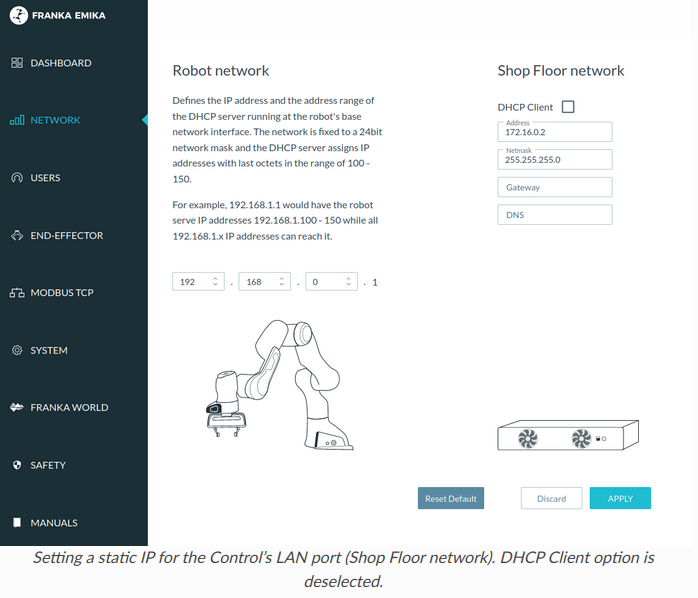

前置
- [[on-off]]打开，[[connect-base]]中可以连接上底座
  - 注意目前仍是连机械臂网口。但是这是临时的，目的是使得控制柜网口能用。参考[[temp-solution]]

步骤
- 官方文档，从[这里](https://frankaemika.github.io/docs/getting_started.html#installing-the-fci-feature)开始看
> If it is already installed to the controller, it will be listed under Desk –> Settings –> System –> Installed Features.

- 为机械臂控制柜网口设置静态ip（参考[[wired-connection]]. 这是为了之后能连控制柜网口）
  - 当然，要记住你设置的网段，比如`172.16.0.2`，之后连控制柜时把本地例如可以设成`172.16.0.1`
  - 注意这些都会禁用[[DHCP]]
> To set up a static address, enter the following values in the Network section

注意左边是机械臂网口设置，右边是控制柜网口

- 设置好之后，参考[[wired-connection]]，使得可以通过控制柜网口和`172.16.0.2`连接机械臂。也可尝试开锁