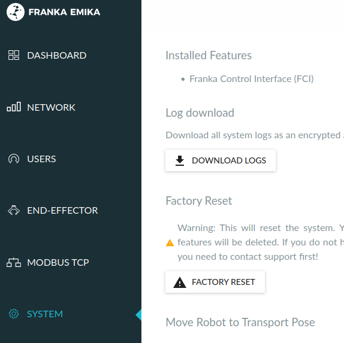

前置
- [[linux-kernel]]（需要实时内核），[[rt-kernel-gpu]]
- [[ros/installation]]之后，`sudo apt install ros-melodic-libfranka ros-melodic-franka-ros`（注：假设你的ros是melodic）
- [[on-off]]打开，[[unlock]]解锁
  - 注意目前仍是连机械臂网口。但是这是临时的，目的是使得控制柜网口能用。参考[[temp-solution]]

步骤
- 官方文档，从[这里](https://frankaemika.github.io/docs/getting_started.html#installing-the-fci-feature)开始看
> If it is already installed to the controller, it will be listed under Desk –> Settings –> System –> Installed Features.

- 为机械臂控制柜网口设置静态ip（参考[[wired-connection]]. 这是为了之后能连控制柜网口）
  - 当然，要记住你设置的网段，比如`172.16.0.2`，之后连控制柜时把本地例如可以设成`172.16.0.1`
  - 注意这些都会禁用[[DHCP]]
> To set up a static address, enter the following values in the Network section

注意左边是机械臂网口，右边是控制柜网口

- 设置好之后，参考[[wired-connection]]，使得可以通过控制柜网口和`172.16.0.2`连接机械臂
- 继续看[文档](https://frankaemika.github.io/docs/getting_started.html#preparing-the-robot-for-fci-usage-in-desk). 我们用的是ros，所以[ros可视化确认安装](https://frankaemika.github.io/docs/franka_ros.html#ros-visualization)
  - `roslaunch franka_visualization franka_visualization.launch robot_ip:=172.16.0.2 load_gripper:=true`