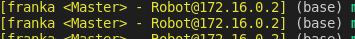

前置：
- [[moveit-real-robot]]
- 了解[[moveit-python]]
- 一些心理建设（这个包不是官方的而且停止维护了，肯定很多疏漏。[[dont-trust-others]]）
  - 比如一些运行现象和文档不对应
  - 比如[[zsh]]用不了（[[non-standard]]）
  - 比如可能缺包
- 我没试`py3`，反正`py2.7`可以[[pip]]补包得到依赖项
  - 文档说了的：`pip install future`
  - 文档漏了的：`pip install numpy numpy-quaternion`
  - 而且我也不确定运行别的`launch`和`py`文件会不会要更多依赖

步骤：
- 这是个懒人包：https://github.com/justagist/franka_ros_interface
  - 这比[[franka-ros]]还要高层，区分[[fci]]
  - 其中安装不要全听文档
    - 请参考[[install-ros-package]]，在`catkin_ws/src`多`git clone`文档说的东西
    - 其它的命令（比如`catkin_make`之类的）别听他的，用你自己的
      - 比如你可能需要[[franka-ros]]的`-DFranka_DIR`参数
    - 需要听他的就是`git clone`什么东西
      - `git clone -b v0.7.1-dev https://github.com/justagist/franka_ros_interface`
      - `git clone https://github.com/justagist/franka_panda_description.git`
  - 其它听文档即可（拷贝的`franka.sh`中有详细说明）
- 用法也看文档
  - 这个对[[zsh]]支持不好（参考[[non-standard]]）。应当
  - 修改`franka.sh`最后一行的`${SHELL}`为`/bin/bash`（否则如果用户默认[[zsh]]就会默认`/bin/zsh`，从而就不行了）
  - 之后也在`bash`运行这个包相关的东西（比如`bash`运行`./franka.sh master`）
  - 运行后效果是这样的，`bash`多东西
- 简要用法
  - 一个有`[franka <Master> - Robot@172.16.0.2]`这种东西（且处于`python2.7`）的终端
  - `roslaunch franka_interface interface.launch`
  - 另一个（可以是普通）终端直接跑`python2.7`脚本即可比如：
    - `sudo apt install ros-melodic-rospy-message-converter`之后
      - （[参考这个](https://github.com/uos/rospy_message_converter/issues/25)：不要用`pip`装）
    - 在`py2.7`环境跑这个文件夹的`moveit_python/franka_ros_interface_keyboard.py`
- 进一步懒人包
  - `pip install panda-robot`，[github页面](https://github.com/justagist/panda_robot)
  - 然后直接逐行运行官网命令都行（当然前提也是上一节的`roslaunch`那个终端。所以这里的`python`是在第二个终端）
    - 此处没`scipy numba`则会警告精确度下降。不过可以先不管
  - 这个运动速度有点快。需要注意安全
    - 可以[文档](https://projects.saifsidhik.page/panda_robot/DOC.html)上全文搜索`velocity`找到：
    - 只需`<PandaArm对象>.set_joint_position_speed(0.05)`（数字可变）即可设置最高速的比例
  - `<PandaArm对象>.enable_robot`：出错了恢复，能恢复一部分错（参考[[troubleshooting]]）
```python
>> python # or `python3` # start interactive python session; make sure the correct ros workspace is sourced.
>> import rospy
>> from panda_robot import PandaArm
>> rospy.init_node("panda_demo") # initialise ros node

>> r = PandaArm() # create PandaArm instance

>> r.move_to_neutral() # moves robot to neutral pose; uses moveit if available, else JointTrajectory action client

>> pos,ori = r.ee_pose() # get current end-effector pose (3d position and orientation quaternion of end-effector frame in base frame)

>> r.get_gripper().home_joints() # homes gripper joints
>> r.get_gripper().open() # open gripper

>> r.move_to_joint_position([-8.48556818e-02, -8.88127666e-02, -6.59622769e-01, -1.57569726e+00, -4.82374882e-04,  2.15975946e+00,  4.36766917e-01]) # move robot to the specified pose

>> r.move_to_cartesian_pose(pos,ori) # move the robot end-effector to pose specified by 'pos','ori'
```