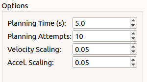
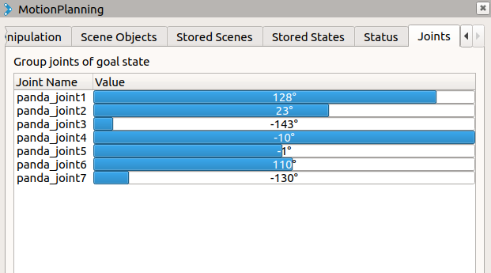

前置
- [[fci]]
- [[moveit-installation]]
- 机械臂蓝灯亮

步骤
- 这里和[[moveit-installation]]中命令的唯一区别就是`roslaunch panda_moveit_config`后面跟的指令不同
  - 其它的，你会动虚拟机械臂就也会动真实机械臂！非常爽
  - 注意一定要限速！手时刻拿软紧急制动！否则非常危险！
    - 如果猛地撞墙，很有可能就报错红灯亮了！只能[[on-off]]重启，并在[[control-using-desk]]根据指示修复错误
    - 如果制动了，则粉色灯亮，则需要白灯再蓝灯，从而参考[[troubleshooting]]需要重新`roslaunch`
  - 即：rviz操作、保存等和[[moveit-installation]]相同
- [[moveit-installation]]中的`demo.launch`和我们这里需要的`panda_moveit_config demo.launch`显然是并列关系
  - 参考https://github.com/ros-planning/panda_moveit_config/tree/melodic-devel/launch
  - 具体命令：`roslaunch panda_moveit_config panda_control_moveit_rviz.launch robot_ip:=172.16.0.2`
## 防止到硬件极限
- 到了诡异的位置（关节到接近**硬件**极限），就动不了了
  - 需要白灯，复位到合理位置，再蓝灯
    - 到底是谁接近了极限？终端里会有黄色警告
    - 复位时要特别小心，否则白灯会变红灯，需要重新开锁，再尝试复位
  - 注：此时要重新`roslaunch`，参考[[troubleshooting]]
- 怎么永久消除接近**硬件**极限的风险？
  - 我们百度知道有`soft*limit`这个东西的存在，于是到[[create-catkin-ws]]创建出的空间中，凭感觉，一搜`find . -type f | grep franka | xargs grep soft | grep limit`就搜到在哪了
  - 在`./src/franka_ros/franka_description/robots/panda_arm.xacro:      <safety_controller k_position="100.0" k_velocity="40.0" soft_lower_limit="-2.8973" soft_upper_limit="2.8973"/>`，我们直接`vim`进去改那些数值即可（比如`2.8973`改成`2.7973`）
- 改完了确认
  - 可以[[moveit-real-robot]]中左侧这个界面确认limit确实被修改了（不过要弧度转角度）
  - 还可以`diff ./src/franka_ros/franka_description/robots/panda_arm.xacro ./src/franka_ros/franka_description/robots/panda_gazebo.xacro | grep safety_controller -C 2`进行确认我们确实都是改保守了
    - 参考[[xxd-diff]]，[[find-grep]]
    - 正确效果
```text
> 
64c61
<       <safety_controller k_position="100.0" k_velocity="40.0" soft_lower_limit="-2.7973" soft_upper_limit="2.7973"/>
---
>       <safety_controller k_position="100.0" k_velocity="40.0" soft_lower_limit="-2.8973" soft_upper_limit="2.8973"/>
69c66,67
<       <limit effort="87" lower="-2.8973" upper="2.8973" velocity="2.1750"/>
--
> 
97c93
<       <safety_controller k_position="100.0" k_velocity="40.0" soft_lower_limit="-1.6628" soft_upper_limit="1.6628"/>
---
>       <safety_controller k_position="100.0" k_velocity="40.0" soft_lower_limit="-1.7628" soft_upper_limit="1.7628"/>
102c98,99
<       <limit effort="87" lower="-1.7628" upper="1.7628" velocity="2.1750"/>
```
- 有趣的是，gripper有时也会到极限（张太大），手动往里推再Homing即可