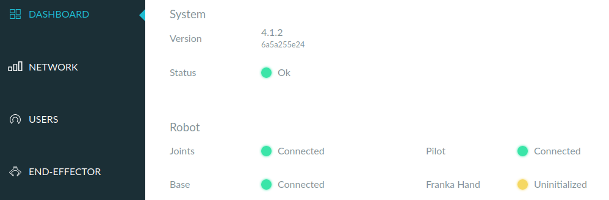

- 如果（比如你手动动了gripper，或者重启电脑等），就需要在END-EFFECTOR选项卡处Homing
  - 参考[issue](https://github.com/frankaemika/franka_ros/issues/16)
  - 尽量不要手动动gripper
- [[moveit-real-robot]]的命令无法运行时，可以看[[fci]]的`communication_test`怎么样，再进一步看`ping <fci-ip>`延迟是否低于1ms
  - 逐级排查！看问题到底出在哪
  - 这是[[primitive-operations]]的思想
- 如果`communication_constraints_violation`那么
  - 可能是通信问题，[参考这个](https://frankaemika.github.io/docs/troubleshooting.html#motion-stopped-due-to-discontinuities-or-communication-constraints-violation)提升CPU，网络性能等
  - 可能是`reflex`错误（提示信息会写），[参考](https://frankaemika.github.io/docs/libfranka.html#errors)解决
  - 注：有些报错甚至会导致之后各种让机械臂运动的命令都用不了，连软件recovery也没用，必须手动白灯再蓝灯