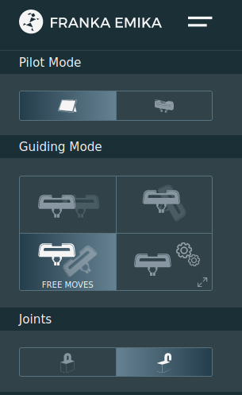

前置
- [[franka-panda/on-off]]启动到黄灯常亮
- 有网口的电脑。需要**直连**电脑和机械臂（如果用转接头等可能会影响速度等，导致不给连接）
- [[linux-kernel]]（需要实时内核），[[rt-kernel-gpu]]

参考https://frankaemika.github.io/docs/getting_started.html
机械臂有网口，控制柜也有网口。我们先连机械臂网口，进行配置，之后再连控制柜
[教程，看第一个视频](https://mp.weixin.qq.com/mp/homepage?__biz=MzI1MDQyMTQ2Mw==&hid=2&sn=b0ae69e54148897202a821d0a48d79e9&scene=1&devicetype=android-29&version=28000653&lang=zh_CN&nettype=3gnet&ascene=7&session_us=gh_8f8e4c6a8bf8&pass_ticket=v3fxJbAjVoDUxQTg9j07UZ1xyvu8oHbx4Mk%2F5beeCBiI87W8PE%2FgLDbCygl6zF0M&wx_header=1&from=groupmessage)
这里提到机械臂地址`192.168.0.1`，所以参考[[wired-connection]]登录上`192.168.0.1`，然后创建管理员账户或是询问机械臂代理商得到用户名密码（如果代理商已经设置好了），登录进界面

Joints处开锁，等待黄灯变白灯，机械臂就可以（轻轻按住gripper旁的按钮）动了！
注：蓝灯时能编程控制不能手控。更多信息参见文档