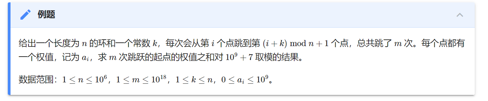

- 分治很多时候用[[oi-wiki-basic/recursion]]实现
- 步骤
  - 分解（为结构相同独立子问题）
  - 解决
    - 往往[[oi-wiki-basic/recursion]]
    - 并注意出口
  - 合并
  - 不同算法的各步骤难度不同
    - [[quick-sort]]分解难，合并简单
    - [[merge-sort]]相反
- 例子：[[25-merge-k-sorted-lists]]
- 和[[binary-search]]联系
  - 分解之后只需解决一个，不用解决两个，然后合并，那就是[[binary-search]]
# 分治和[倍增](https://oiwiki.org/basic/binary-lifting/)
- 分治和倍增是一体两面
- [参考](https://oiwiki.org/basic/binary-lifting/)
- 比如用3个砝码称出1到7七种重量
  - 相当于把7分治成4和3（而不是6和1）
  - 这种思想在分治中也很常见
- 比如 
  - 给出每点开始连跳1步之和
  - 然后算出每点开始连跳2步之和
  - 以此类推
  - 于是给定100步，就先看当前点的64步之和，然后算出64步后是哪个点，再看剩下的