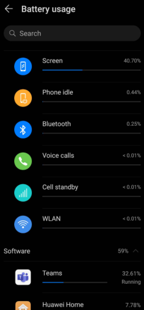
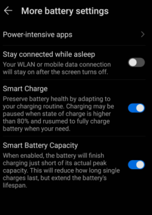
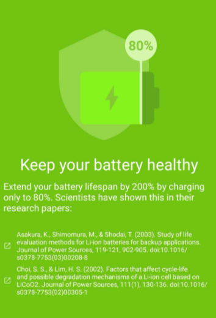

## 如何省电
- 设置的battery相关部分找usage等字眼，看到哪些硬件软件耗电占比多，针对性处理
  - 典型结果
  - 上面结果中，针对硬件可调低[[brightness]]（关闭自动亮度），减少亮屏
  - 针对软件可在不需要时关闭耗电大户的后台运行（参考[[optimize]]）
- 设置里专门找power saving mode和ultra power saving mode等字眼
  - 有些版本的ultra power saving mode是只能打电话发短信等
  - 有些版本更加灵活，可以自己指定“只有哪些应用可以用”，比如微信、支付宝
- ultra power saving mode实际应用场景示例
  - 出门剩一点点电应急，开ultra power saving mode只允许微信运行
  - 扫单车时开启位置、网络和蓝牙，扫完马上关
  - 拿快递柜快递时开启位置、网络，拿完马上关
  - 付钱时开启网络，付完马上关
  - 等等
## 如何延长电池寿命
- 电池寿命损耗：相当于“上限”变小，全充满能使用的时间更少
- 充满会损害电池
  - 设置Battery的角落里可能有80%或98%等暂停的选项，如图
  - 这里只是暂停，没法保证，也没法灵活调节。而且也不是所有品牌手机都有
- 所以可以使用App: AccuBattery
  - 
  - 给予适当权限（如应用使用情况`usage`等）就可以查看用电情况 + 控制充电