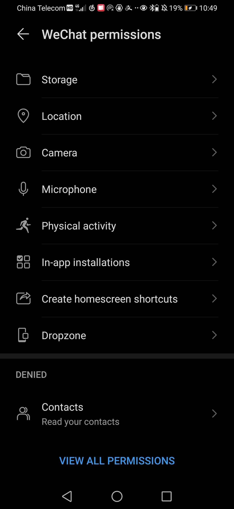

- 应用权限
    - 在手机设置中关于“应用”的部分（如`Apps`），找关于“权限”的部分（不同型号可能不同）
    - 
    - 重要：`Create homescreen shortcuts`，打开了就允许创建桌面快捷方式，省力
      - 例如创建支付宝公交码快捷方式，坐公交一键调出
      - 例如微信近邻宝使得可以一键开快递
    - 其它：比如位置，相机等权限有时是必要的，你要是不小心关了导致应用用不了就在这里开
- 应用启动（“生杀大权”）
    - 也是在关于“应用”的部分，找关于“启动”“launch”的部分
    - Auto-launch：开机启动
    - Secondary launch：被其它应用启动
    - Run in background：后台运行
- 通知栏通知：不妨暴力让那些你不想通知你的应用不许发，免得打扰你