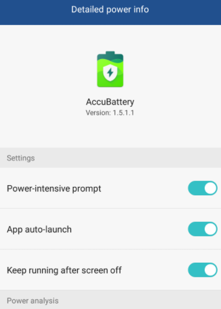

- 应用权限
    - 在手机设置中关于“应用”的部分（如`Apps`），找关于“权限”的部分（不同型号可能不同）
    - 
    - 重要：`Create homescreen shortcuts`，打开了就允许创建桌面快捷方式，省力
      - 例如创建支付宝公交码快捷方式，坐公交一键调出
      - 例如微信近邻宝使得可以一键开快递
    - 其它：比如位置，相机等权限有时是必要的，你要是不小心关了导致应用用不了就在这里开
- 应用启动、杀后台（“生杀大权”）
    - 也是在关于“应用”的部分找。不同系统版本和厂商的位置不同
    - 比如找关于“launch”的位置
    - 比如找关于“battery”的位置
      - 注：这个“battery”指的是设置项叫battery，和AccuBattery这个app没有直接关系
    - Auto-launch：开机启动
    - Secondary launch：被其它应用启动
    - Run in background：后台运行
    - 举例：被杀后台的效果，参考[[android/battery]]中`AccuBattery`软件被杀
- 通知栏通知
  - 根据不同厂商UI，设置具体方法可能不同
    - 比如可能在设置的`Notification`相关中
    - 也可能在通知栏处直接可以设置
  - 不妨暴力让那些你不想通知你的应用不许发，免得打扰你
  - 也可以精准防控：比如只屏蔽广告或只不给广告出声，等