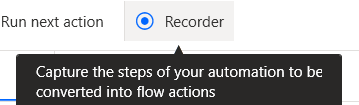

前置：
- [[my-first-flow]]

步骤
- flow编辑器的这里
- 打开之后傻瓜式操作
  - 过程中可以暂停，删除动作，拖动recorder窗口防遮挡等
- 经常会自动记录出很多`Click UI element`
  - 这些可能“泛化性”不够强
    - 原因是UI element名、窗口名等都可能不同
    - 比如[[telegram]]窗口名有未读消息数
  - 因此就需要（记录完后，手动）调整成
    - 鼠标直接移动到指定位置（比如右下角语言栏，位置固定）
    - 或用[[selector-builder]]更改查找UI元素的方法（比如只要求窗口包含`Telegram`字符串）
    - 或[[ocr]]、找图
    - 参考[[generalization]]