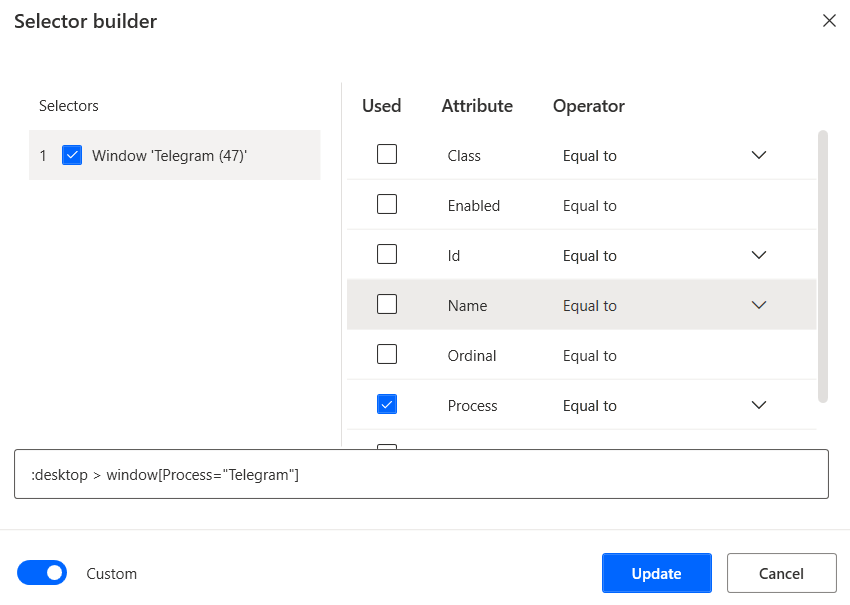
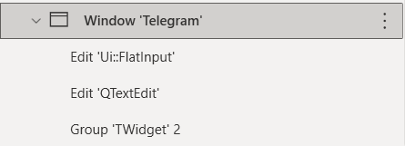

前置：
- [[recording]]

[官网教程](https://docs.microsoft.com/zh-cn/power-automate/desktop-flows/build-custom-selectors?msclkid=a261a4abcef311ec95ccac0f23ce2c68)
步骤：
- 右侧“三叠”按钮
  - 可以直接新建selector（按要求`Ctrl+左键`）选择，或者从[[recording]]中找到现有selector
- 对selector修改
  - 例如[[telegram]]的窗口名会动态变（包含未读信息数），所以我们可以不管Name，只管Process
    - 
  - 完了之后也可以把自动生成的窗口名`Telegram (<数字>)`改掉成`Telegram`，如图
    - 当然这里的`Group *`这些名字也是自动生成的，你也可以改成更显眼的名字，比如这里的`Group *`其实是右上角叉
- 某个变量名对应的selector变量在哪里用到了呢？可以右键selector变量查看
  - 三个点处还有Remove unused选项，可以避免太多无用UI selector变量占位置
- 最终必杀技：[[ocr]]等更能[[generalization]]的技术
- 注：点击ui时可以选择所处部位。例如那种资源管理器地址栏选右侧才是“文字”部分