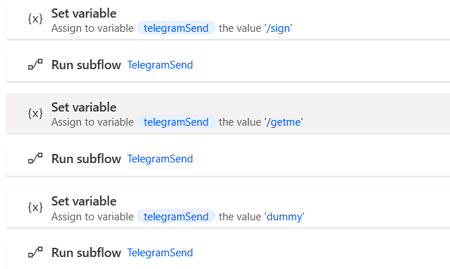

前置：
- [[my-first-flow]]

步骤
- Subflow最简单用法：分块——把你的大的flow分成几块，方便区分
  - `Ctrl`多选（或`Ctrl+A`全选），`Ctrl+X`剪切这部分
  - 上方bar处新建Subflow，`Ctrl+V`粘贴过去
    - 粘贴位置：如果选了某个模块，就粘在它上面。否则在最后
  - 设置若干个Subflow后在Main里左侧`Flow control`**加入写好的Subflow**（按顺序执行）
    - **Main里面如果啥都没有，你在Subflow界面按播放键也不会有任何动作！**
- 稍微复杂：可以作为子过程，用条件、循环等控制
- 更复杂：含有[[power-automate/var]]，根据变量值不同微调功能
  - 
  - 可以看出，“执行函数`f(x)`”在这里需要两个动作！先设置变量，再说“要执行什么函数”。参考[[power-automate/var]]所说的“只有全局变量”