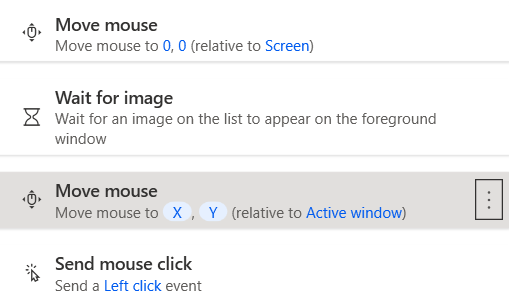

前置：
- [[power-automate/var]]

- 全自动中，直接`Wait`指定时间（多少秒）太不好了，容易不能泛化
- 解决方法比如：可以`Wait for image`
  - 图片来源：右侧“图片”标签，`Capture image`按钮
    - 按下按钮时会自动最小化Power Automate，非常方便
  - 不过注意这时就必须考虑鼠标位置。很多时候一高亮图就不一样了
  - 典型操作如下
  - 等到了图片，被存到了`X`，`Y`变量中
    - 此时[[mouse]]动作里用`%X+100%`这样就可以使用
  - 注意上图中的坐标都是相对于窗口而不是全屏幕
    - 总之`Wait for image`和`Move mouse`[[power-automate/var]]含义对应即可
  - 找图是模糊的，可以通过tolerance参数调整
    - 比如该参数太大时，找这种文字图时文字变一变还能被识别
    - 如刚刚的On和Off都被识别
- 如果想半自动
  - 比如“我搞完这部分了，跟电脑说一声；电脑搞完这部分了，跟我说一声”这种
    - 比如每天看邮件
  - 那就`Wait for shortcut key`
  - 可以结合`Workstation`分类中发出声音等动作，提醒你！
- 开机、刚启动应用时加载较慢，可能导致wait时间不够。适当增加wait时间即可能解决
  - 可能还可以[[wait-for]]某个东西，这相比magic number时间（秒数）更容易**泛化**
    - 图
    - 文字（[[ocr]]）
    - UI元素（[[selector-builder]]）
    - 鼠标指针图案变化
  - 可能还可以检测**先出现再消失**某个文字提示，图片，鼠标指针等，更靠谱
  - 一些可能的问题：鼠标指针闪烁反复横跳
- UI，[[ocr]]，图各有特点。经常用来等待或模拟鼠标操作
  - UI最clean最本质，但是如果它经常变你就找不着（比如高亮，正在被选等）
    - [[selector-builder]]可能解决
  - [[ocr]]相比也比较clean（比如换机器时文字往往还是那个），但可能被遮挡，可能识别不到（字长得奇怪，或者字太小）等
  - 图看起来最靠谱，但是也可能被遮挡，高亮，或者换机器、版本、缩放大小之后变化等
- 总之，等待和鼠标操作往往都挺麻烦的。能键盘操作就键盘操作yyds
  - 参考[[send-key]] [[py-keyboard]]
  - 不过有时也需要适当等待系统反应。不是键盘就不用等了