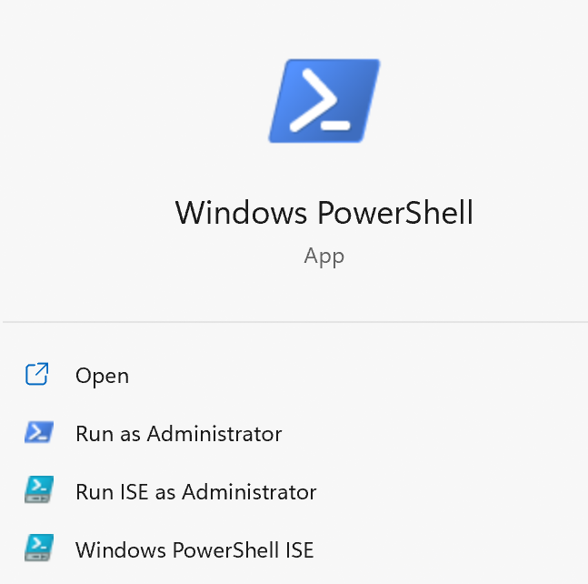

- 开始菜单以管理员运行

- vscode中powershell以管理员运行：[参考](https://blog.csdn.net/Cloud1209/article/details/120390525#:~:text=VScode%20powershell%E5%8D%87%E7%BA%A7%E7%AE%A1%E7%90%86%E5%91%98%E6%9D%83%E9%99%90_%E4%BA%91%E4%BA%91%E7%9A%84%E4%BA%91%E7%9A%84%E5%8D%9A%E5%AE%A2-CSDN%E5%8D%9A%E5%AE%A2_powershell%20vscode%20%E7%AE%A1%E7%90%86%E5%91%98,1%E3%80%81%E7%BB%99vs%E5%BF%AB%E6%8D%B7%E6%96%B9%E5%BC%8F%E5%90%AF%E5%8A%A8%E9%80%89%E9%A1%B9%E5%8A%A0%E4%B8%8A%E7%AE%A1%E7%90%86%E5%91%98%E5%90%AF%E5%8A%A8%E5%8F%B3%E9%94%AE%E5%B1%9E%E6%80%A7-%26gt%3B%E5%85%BC%E5%AE%B9%E6%80%A7-%26gt%3B%E5%8B%BE%E9%80%89%E7%AE%A1%E7%90%86%E5%91%98%E5%90%AF%E5%8A%A82%E3%80%81%E7%AE%A1%E7%90%86%E5%91%98%E8%BA%AB%E4%BB%BD%E6%89%93%E5%BC%80powershell%E6%89%A7%E8%A1%8C%EF%BC%9Aget-ExecutionPolicy%EF%BC%8C%E8%BF%94%E5%9B%9ERestricted%E6%89%A7%E8%A1%8C%EF%BC%9Aset-ExecutionPolicy%20RemoteSigned%E8%BE%93%E5%85%A5Y3%E3%80%81%E9%87%8D%E5%90%AFvscode...%20VScode%20powershell%E5%8D%87%E7%BA%A7%E7%AE%A1%E7%90%86%E5%91%98%E6%9D%83%E9%99%90)