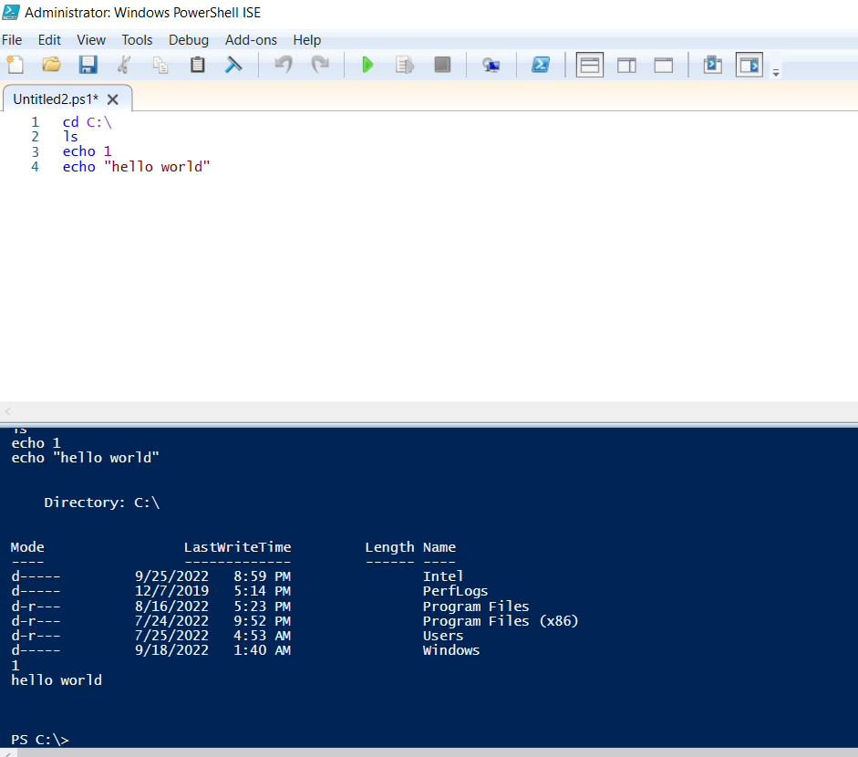

- 前置
  - [[powershell/basics]]
  - [[administrator]] powershell中`Set-ExecutionPolicy -Scope CurrentUser RemoteSigned`使得允许运行自己写的`.ps1`脚本
  - （可选）刚刚只是允许右键手动运行。如果想要双击运行，则需
    - 尝试改`.ps1`的打开方式（参考[[file-format]]）为`C:\Windows\System32\WindowsPowerShell\v1.0\powershell.exe`
    - 如果仍不行，那就设置一个快捷[[link]]，其中的属性指向模仿`powershell.exe "& '<路径>.ps1'"`即可。双击链接即可执行脚本
- 开始菜单搜索powershell ISE，即可开始使用
  - 
- 也可保存`.ps1`脚本，之后可用于双击运行，甚至创建快捷方式，从而和[[link]]中所说快捷键结合，一键运行脚本，非常方便
- 在脚本中运行其它脚本：`<路径>\<名字>.ps1`，例如`.\1.ps1`
  - 这点类似linux的shell，`.\`不能省略