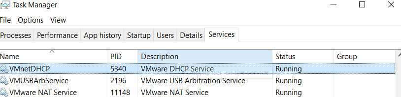

- Basic Usage
  - `Stop-Process -Name chrome`
  - You can check the process name in the task manager or input a part of it and use tab to autocomplete the name.
- However, forcibly closing a process may not be clean, refer to the concept of [[finally]]
  - For example, some [[windows-proxy-client]]
    - When the client process is closed, the kernel `v2ray` may remain and even occupy the port.
    - Furthermore, if you forcibly close `v2ray`, you may find other issues, such as the automatic proxy switch not being turned off for you.
  - For example, if you forcibly stop a virtual machine [[network]] related process, `NAT` and `DHCP` and other Services may stop. You will need to manually start them in Task Manager - Services.
    - 
- Example of starting a subprocess
  - ```powershell
    $psi = New-Object System.Diagnostics.ProcessStartInfo
    $psi.FileName = "ssh"
    $psi.RedirectStandardInput = $true
    $psi.RedirectStandardOutput = $true
    $psi.UseShellExecute = $false

    if ($user_at_ip -like "*github*"){
        $psi.Arguments = "-T -o StrictHostKeyChecking=no -o ConnectTimeout=2 -i $key $user_at_ip"
    } else {
        echo "username: "
        $psi.Arguments = "-o StrictHostKeyChecking=no -o ConnectTimeout=2 -i $key $user_at_ip 'whoami'"
    }

    $process = New-Object System.Diagnostics.Process
    $process.StartInfo = $psi
    $process.Start() | Out-Null
    $process.WaitForExit()

    # Redirect the output to the main process
    $processOutput = $process.StandardOutput.ReadToEnd()
    echo $processOutput

    # Check the exit code of the process and print appropriate message
    if ($process.ExitCode -eq 0) {
        echo "Success"
    } else {
        echo "Failed with exit code: $($process.ExitCode)"
    }
    ```
  - Note: `.ExitCode` success is `0`, so you need to use `-eq 0` to judge success. This is different from `$?` in [[ps-condition]], but the same as [[12-condition]], which can be tricky.
