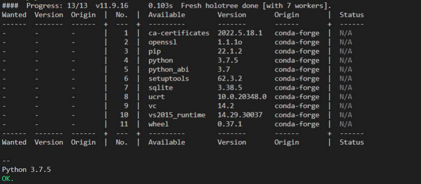

- 前置
  - [[robot-yaml]]
  - [[create-env-yaml]]
- [参考](https://robocorp.com/docs/setup/environment-control)
- [参考本地文件](../example/robot-yaml/conda/conda.yaml)
- 书写格式参考[[create-env-yaml]]
  - 由于指定了`conda.yaml`，故运行这个robot可以`rcc run`或用vscode集成的插件两种方式，不是非得[[rcc]]
  - `robot.yaml`中增加`condaConfigFile`字段来使用`conda.yaml`
- 结果
  - 此robot输出python版本是`conda.yaml`指定的版本，和直接`python`命令输出的不同，就知道`conda.yaml`的作用了
  - 