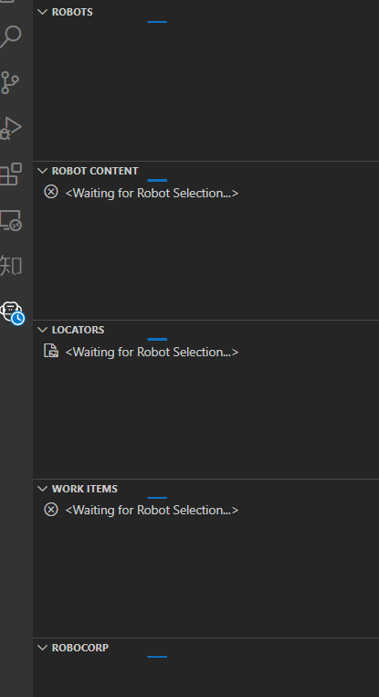
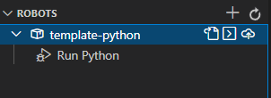
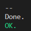

前置
- [[robocorp/basics/installation]]
- 其中`google-image-search`robot需要[[configure]]代理
  - windows使用[[windows/env-var]]

步骤
- [官方参考文档](https://robocorp.com/docs/setup/robot-structure)
- [去这找例子玩](https://robocorp.com/portal/)
# 例子：`python`最小样例
- `git clone https://github.com/robocorp/template-python.git`
- vscode打开此库
    - 此时对于windows系统可能自动出现[此troubleshooting](https://robocorp.com/docs/troubleshooting/windows-long-path)，和长路径名有关
    - 照[链接](https://robocorp.com/docs/troubleshooting/windows-long-path)做即可，按指示重启之后可以进入下一步
    - 注：如果有[[administrator]] powershell，就可以一行命令`rcc configure longpaths --enable`搞定
- 左侧出现robocorp图标（那个机器人）
  - 点它，现在开始加载
  - 过程可能需要一定时间（主要是下载装包等）
    - 可能需要为vscode配置代理
- 开始运行
  - vscode左侧robocorp图标
  - 中三角播放按钮
  - 运行成功结果：终端有这样的输出，包括绿色`OK`
  - `output`文件夹也有记录输出
# 例子：谷歌搜索图片并保存
- 需要[[configure]]代理
  - windows是设置[[windows/env-var]]，参考[robocorp用代理](https://robocorp.com/docs/troubleshooting/firewall-and-proxies)
- `git clone https://github.com/robocorp/example-google-image-search.git`
- 挂好代理，并[[configure]]
- 运行方式和上一节类似。运行成功效果：
  - 下方有提示，也有绿色`OK`
  - 打开（可能用浏览器等）运行成功生成的`output`中的`log.html`，可以找到更详细的日志，且找到猫猫图片