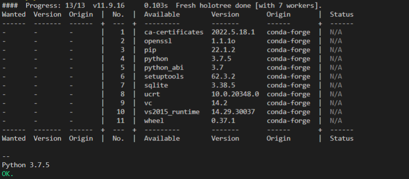

- 前置
  - [[robocorp]]中的命令行工具`rcc`
    - 否则只能用vscode集成的不够灵活的rcc，于是不能使用这里的部分robot
  - 对于windows需要[[powershell-basics]]可以使用`python`命令
    - 即安装了`python`
    - 并把`python.exe`所在路径加入了[[windows/env-var]]的path
      - 如果你没安装`python`，那么[[powershell-basics]]中输入`python`命令将会到安装界面，而不是正常启动！
      - 参考[[windows/env-var]]中关于`python`命令的坑
  - 了解`python -c`，`python -V`
  - 体验[[my-first-robot]]中的两个robot
  - [[yaml]]
  - [[create-env-yaml]]
- [官网教程](https://robocorp.com/docs/setup/robot-structure)
## 典型设置
- minimal robot structure及`robot.yaml`的地位
```text
├── conda.yaml
├── .gitignore
├── output
│   └── # Having a standard place for outputs is always good
├── robot.yaml
└── tasks.robot
```
## 最简单的
- 最简单的 minimal `robot.yaml`
- 在`example-google-image-search`中的各个key含义几乎都是自明的
- [官网教程](https://robocorp.com/docs/setup/robot-yaml-format)也很清楚
  - 至少需要`tasks - <任务名称> - <command | shell | robotTaskName>`和`artifactsDir`两个key
- 所以我们写出最小的能用的`robot.yaml`：[如下](../example/robot-yaml/minimal/robot.yaml)（虽然会报警告）
- 这个robot可以**进`robot.yaml`所在目录**后，用`rcc run`运行，不能用vscode运行
  - vscode不够灵活，要求用conda环境
- 效果是使用默认`python`解释器`print`一行`hello world`
## 使用`conda.yaml`和`.gitignore`
- 查看`104-public-knowledge-base\automation\robocorp\example\robot-yaml\conda`，可以看到多了一个`conda.yaml`文件。书写格式参考[[create-env-yaml]]
  - 由于指定了`conda.yaml`，故运行这个robot可以`rcc run`或用vscode集成的插件两种方式
  - `robot.yaml`中增加`condaConfigFile`字段来使用`conda.yaml`
- `ignoreFiles`字段用于指定忽略的文件。参考[[special-files]]
- 此robot输出python版本是`conda.yaml`指定的版本
