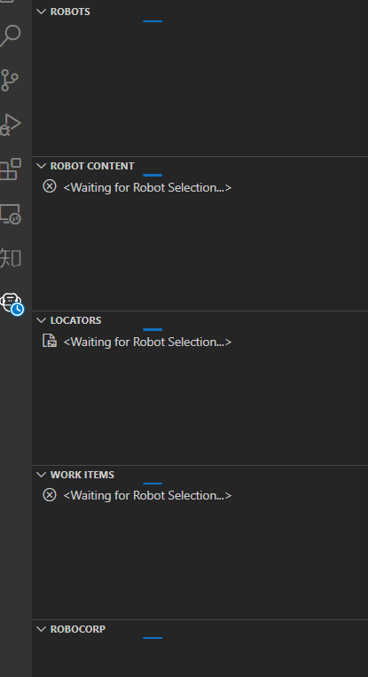

前置
- [[robocorp/installation]]

步骤
- [官方参考文档](https://robocorp.com/docs/setup/robot-structure)
- 举例：最简单的
`git clone https://github.com/robocorp/example-google-image-search.git`下来，vscode打开此库
    - 此时对于windows系统自动出现[此troubleshooting](https://robocorp.com/docs/troubleshooting/windows-long-path)，照做即可
    - 照做重启之后可以进入下一步
- 左侧出现robocorp图标
  - 点它，现在开始加载
  - 过程可能很慢（主要是没挂代理时下载装包慢）