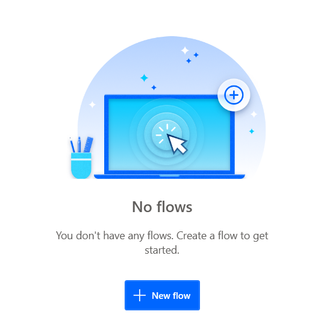
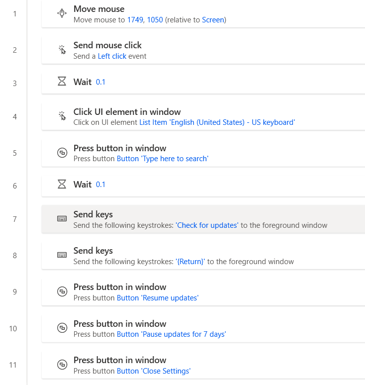

- https://docs.microsoft.com/zh-cn/power-automate/desktop-flows/install
  - 跟着网页，走到“浏览器扩展”这一步（可以参考[[extension]]）
- 打开Power Automate，邮箱登录，跟随教程玩一玩
  - 新建flow
  - 跟着教程简单了解一下如何新建flow
- 尝试用[[recording]]新建第一个flow
  - 可尝试修改它，比如根据[[failures]]提到的，加强泛化性
- 再继续跟着教程了解一下管理flow用的console
- 结果：
  - 得到我们的第一个flow
    - 例如：阻止微软[[prevent-auto-update]]
    - 当然，这其实也就图个乐，因为这样做其实没法阻止它每隔35天强制更新。参考[[prevent-auto-update]]
  - 通过教程，简单理解了Power Automate的基本概念和用法
- 之后你可以保存它到线上
  - **不能到本地**，这是Power Automate的重大缺点，导致无法自动化联网相关过程，比如开代理
    - 这也算是[[dont-trust-others]]的一个例子吧
  - 之后联网时就可复用它
  - 第一次下载可能会比较慢，之后有缓存