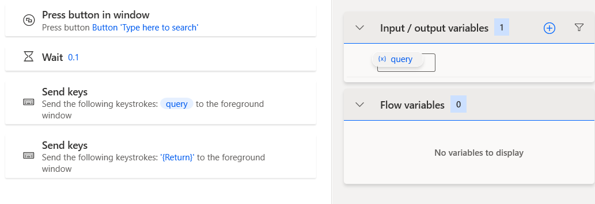
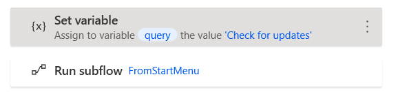

前置：
- [[my-first-flow]]

步骤
- Subflow最简单用法：分块——把你的大的flow分成几块，方便区分
  - `Ctrl`多选（或`Ctrl+A`全选），`Ctrl+X`剪切这部分
  - 上方bar处新建Subflow，`Ctrl+V`粘贴过去
  - 设置若干个Subflow后在Main里左侧`Flow control`加入写好的Subflow（按顺序执行）
    - **Main里面如果啥都没有，你在Subflow界面按播放键也不会有任何动作！**
- 稍微复杂：可以作为子过程，用条件、循环等控制
- 更复杂：含有input variable，根据不同输入微调其功能
  - 例如
    - 输入不同`query`就在开始菜单搜索不同值并打开
    - 外界调用：
  - 这里两个`query`，一个在内使用，一个在外使用。其实在创建时可以设置成不一样的标识符
  - 注：最外层如果没设好默认值，运行时它会要求你输入变量初始值