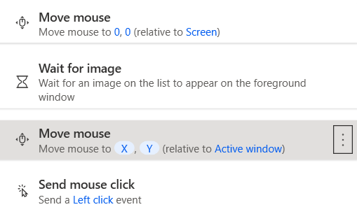

前置：
- [[power-automate/var]]

- 全自动中，直接`Wait`指定时间太不好了，容易不能泛化
比如：可以`Wait for image`
  - 不过注意这时就必须考虑鼠标位置。很多时候一高亮图就不一样了
  - 典型操作如下
  - 注意等到了图片，被存到了`X`，`Y`变量中。`Move mouse`动作里用`%X%`这样就可以使用
  - 注意这里的坐标都是相对于窗口而不是全屏幕。`Wait for image`和`Move mouse`对应即可
- 如果想半自动，比如“我搞完这部分了，跟电脑说一声”这种，比如每天看邮件，那就`Wait for shortcut key`