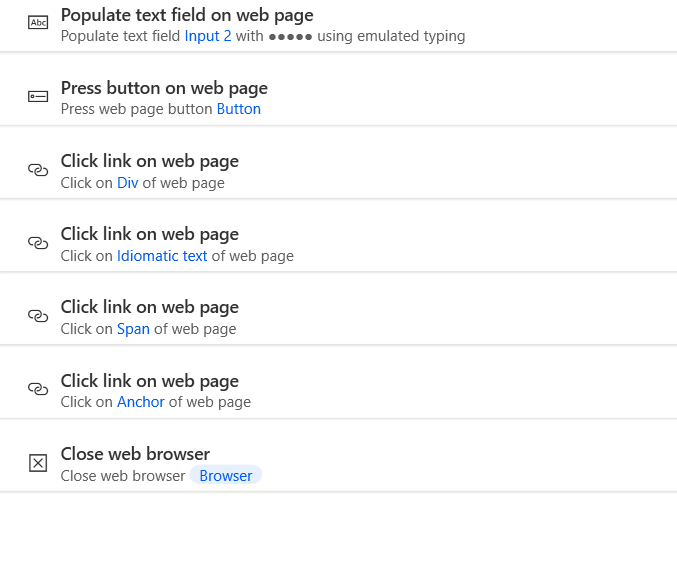

前置：
- [[my-first-flow]]需要“浏览器扩展”
- [[recording]]
- 知道[[save-password]]怎么关闭（要不然容易导致流程不统一，被破坏）

步骤：
- 左侧看`Browser`一栏，看到一些常见操作
- 第一步上某个网页不要用[[selector-builder]]那么麻烦，直接用`Launch mew Microsoft Edge`即可
- 之后正常record操作即可
    - 可以看到能识别在网页上做操作
    - 可以看到对输入密码做了保护，没有明文给出（当然你也可以结合浏览器记住密码功能）
- 过程中如果有跳转，recorder会自动attach跳转后的
- 新标签，关闭标签也有专门指令
  - 一个标签会被存为一个变量。所以你即使不把某个标签设为最前方的，也可以操作它当中的元素
  - 关闭一个窗口的最后一个标签就是关闭窗口
- 应用：每天提醒你检查邮件
  - 需要结合[[wait-for]]，人在旁边看完之后发送指定按键，告诉电脑继续