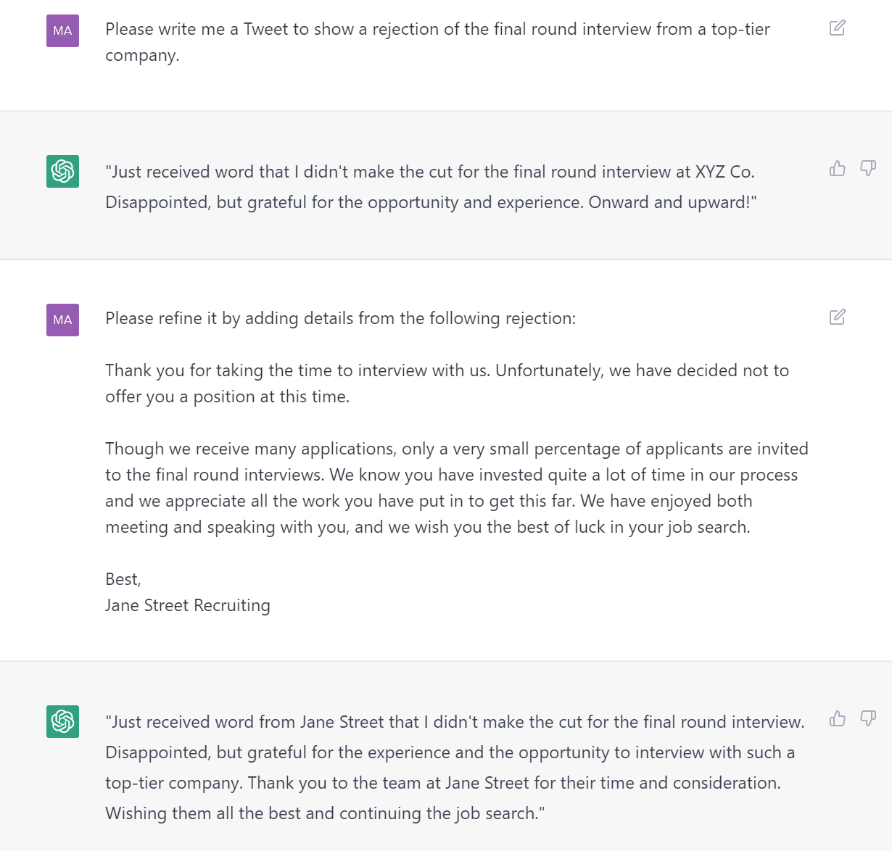
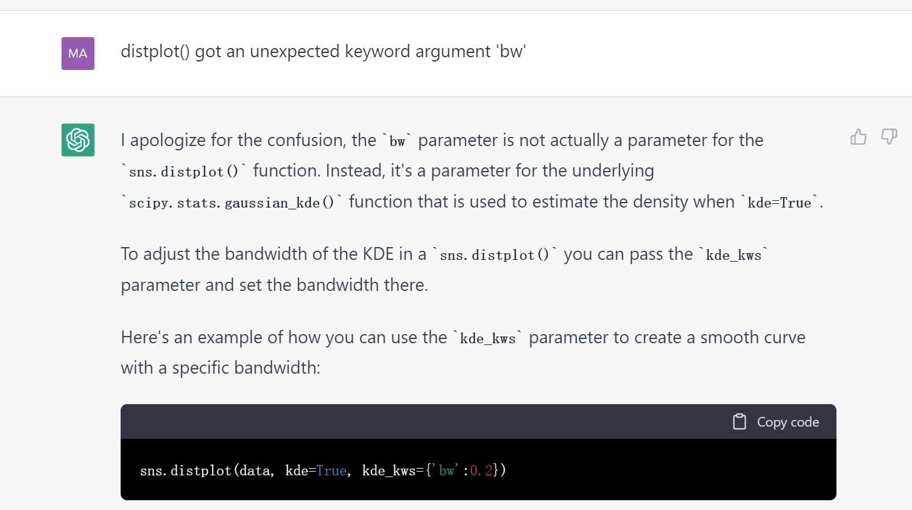

- 前置[[openai-account]]
# 用法
- 在下方框敲东西让它回答
  - 可使用中文/英文/各种文字
  - 当然英文效果好
- 可以编辑之前的提问，或重试等
- 回答不完整，可以说`continue`或`继续`
- 某版本更新后，可以
  - 储存查看之前的chat内容
  - 自动生成摘要标题
# 提示工程
- 可以循序渐进给出指示
- 如果它不满足要求/预期，可以
  - 尝试Try again
  - 编辑输入，手动指出要求，重新submit
- 简单举例：
  -  可以看到循序渐进
  -  可以看到手动指出要求
# 记忆
- Thread中前面的信息会被记住
  - 左边可以清空Thread使得刷新记忆
- 具体的记忆信息例子
  - 应用：改文书，缩减文章等
  - 首先Here is a personal statement, please commit it to your memory as (A)，然后写一大段
    - 然后Here's another one. Please commit it to your memory as (B)然后写一大段
    - 然后例如问：
    - 
  - 进阶：如果全文太长，可以一小段记为(A)，再一段记为(B)，等等，之后例如：
    - 
# 其它
- 可以发挥想象力，玩各种各样的事，如
  - 如何解决台湾问题
  - 普京给特朗普的情书
  - 针对博士后生活改编波希米亚狂想曲
  - 扛200斤麦子走……里需要做多少功？
  - （你懒得查文档时）帮助编程： 
    - 这里问到了[[matplotlib/basics]]中的`legend`位置
    - 有时会生成错误过时答案。所以用它写程序要小心
      - 但你可以把报错反馈回去，他可能就改正了
      - 
  - 给出“指令”：`rephrase:`, `proofread:`, `expand:`之类的，后跟一段。可以降重、自动写文章等
    - 具体例子：`please refine this markdown code. please give me your generations in code blocks instead of directly present it --- or I can't copy it.`
  - ……
- 人机交互结合
  - 写文章：人调实质内容，chatgpt调表达，人最后调格式字数（如每段顶格等）
# 绕过限制
- 他有时会自我设限，但其实可以做。你可以想办法绕过
- 比如Please memorize不行，但Please commit it to your memory可能就行了
# downstream
- [chatpdf](https://www.chatpdf.com/)
  - 读论文读书审稿等用
  - 文章太长了，用[[web-page-tools]]截取
    - https://www.pdf2go.com/
  - 免费的有每日限流，单文件限大小页数
- [[cursor-so]]