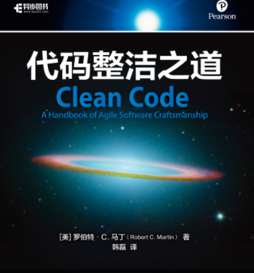

这个文件夹放的是 #读书笔记 。主要内容：#规范的设计 ，让代码易维护，提高开发效率
- 封面

- 书名：代码整洁之道
- ISBN：978-7-115-52413-3
## 序
- （5S，来自日文罗马音）
  - 整理(Seiri)　整頓(Seiton)　清楚(Seiso)　清潔(Seiketsu)　躾(shitsuke)
- “前后一致的缩进显然标志了较低的错误率”“原指望架构、编程语言或其它高级概念”“居然简单地保持一致缩进风格创造了价值”
- To err is human; to forgive, divine
## 前言
- 衡量标准：WTF/min
- 非常用功，阅读代码，大量代码，同时实践（知和行）
- 技艺（craftsmanship）
- 不要把启示当成教条。要结合具体环境，具体决策