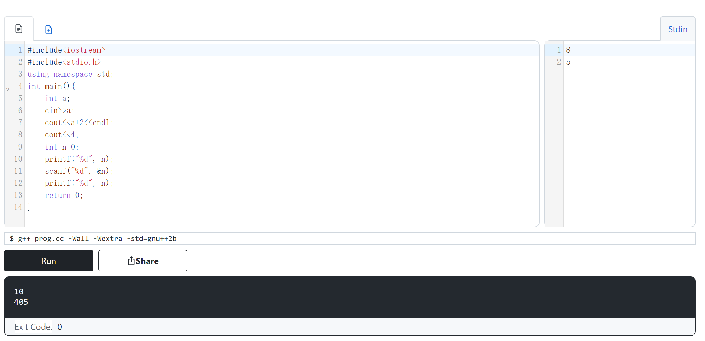

- [参考](https://oi-wiki.org/lang/helloworld/)
# 在线编译运行
- [[wandbox]]
    - 选择C++，然后如图，发现可以正常使用
      - 
      - 注意右边有`stdin`，可以有输入
    - 以上代码的文字版如[此链接](helloworld.cpp)
      - 输入：`8`，`5`
      - 输出：`10`，`405`
- [[coderpad]]
# 进阶
- [[linux-cpp-compilers]]