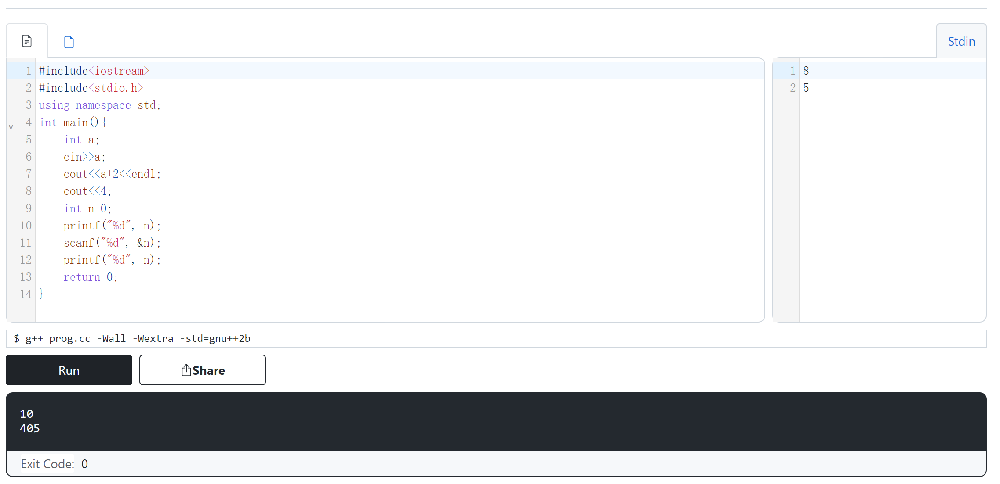

- 本文 https://oiwiki.org/lang/helloworld/
配置基础环境和做minimun working example
- 如果懒得本地搞，可以上各种在线编译器
- 比如
https://wandbox.org/
选择C++，然后如图，发现可以正常使用

```cpp
#include<iostream>
using namespace std;
int main(){
    int a;
    cin>>a;
    cout<<a+2<<endl;
    cout<<4;
    return 0;
}
```
- 比如
https://app.coderpad.io/sandbox
  - 这个可以使用输入。如果你代码里有`cin >>`，那么`Ctrl + Enter`开始运行后右边会可以输入内容。
  - 还有pad功能可以同时写写画画
  - 有snippets功能，类似于[[vscode/snippets]]
    - `Tab`操作也有
    - 可以自动补全方法、模块名
  - 有类似[[vscode/edit]]的`Alt`多光标等