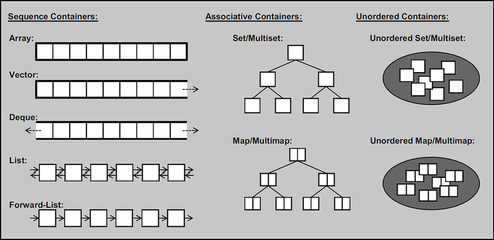

- 前置：[[array]]
- [原文](https://oiwiki.org/lang/csl/container/)

# 分类
- 容器分类
  - 序列、有序（用树维护）、无序（[[hash]]维护）
  - 有序无序都有重复、无重复版本
- 容器适配器如栈、队列：
> ”适配器是使一种事物的行为类似于另外一种事物行为的一种机制”，适配器对容器进行包装，使其表现出另外一种行为。

# 用法
- 声明：`containerName<typeName,...> name;`
- 常用函数：`.empty(), clear(), .size(), a.swap(b)`等
- 迭代器：[[iterator]]，常用`.begin(), .end()`等
- `=, ==, >`等运算符
  - `=`是复制
  - 比较是字典序