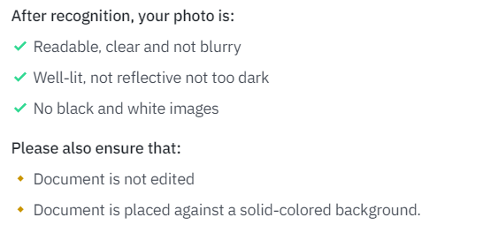
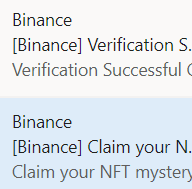
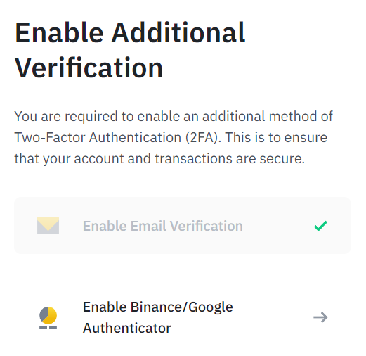
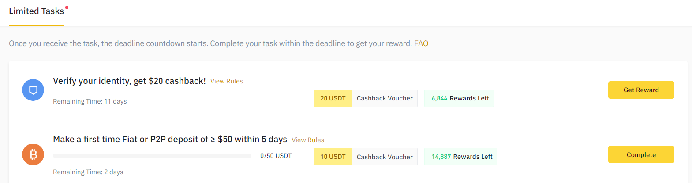

# 身份认证
- 用内地真实信息，真实身份证
  - 对身份证拍摄清晰准确度有要求！
    - 
  - 自拍（用手机或电脑前置摄像头）
  - 人脸识别认证
- 然后提示让你等待
  - 
  - 等待时不能使用
  - 等待完成后邮箱有发邮件
  - 其声称的Estimated completion date可能比实际的晚很多
  - 认证完成后，邮箱收到邮件
    - 且送你一个盲盒(mystery box)
# [[account#2FA]]
- 这时登录提示你完成了第一步verification，但还需要two-factor authentication
  - 
  - 这里以Google Authenticator为例，网页版点上图第二个按钮，并结合手机操作，完成所需步骤（当然需要代理）
  - 最后一步的三个六位验证码，一个手机短信，一个邮箱，还有一个就是authenticator app上实时显示的口令
# 其它
- 苹果手机可以增加存在[[icloud]]的key
- 新手奖励
  - 哈哈，保持身心健康哈，差不多得了（手动滑稽）
  - 