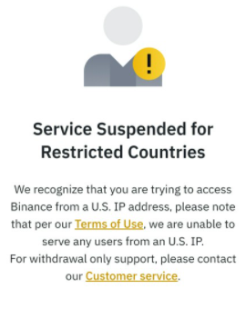

- 前置
  - [[binance]]
  - 主流国际邮箱
  - [[general-principles/account]]
  - 非中国内地、美国[[ip-address]]的[[proxy-basics]]代理或[[vpn]]
    - 美国不行：
    - [[region-language]]
  - 可选：[[nobepay]]注册虚拟visa卡，使得可以smoothly充钱
# 步骤
- [注册binance的网址](https://accounts.binance.com/en/register?ref=IW76A547)
  - 这里已经自动加入了推荐ID，有费率优惠
- 截至2022.7，中国内地法律不允许加密货币交易所，所以随便选个居住地（如香港）
  - 但这个其实目前有点灰色
  - 之后的各个步骤就又可以用内地手机和身份证了
- 选择create personal account
- 填邮箱，密码，推荐ID（以减少佣金费率）
  - 一个可选的推荐ID：`IW76A547`
- 邮箱收邮件，验证邮箱
  - 建议主流国际邮箱如[[outlook]], [[google]]
- 手机收验证码，验证手机（可以使用内地手机）