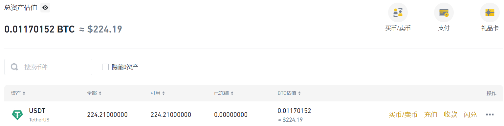

## 前置
- [[binance]]
- [[nobepay]]有的话就比较方便
## fiat / P2P充值
- fiat法币指人民币，美元等
  - 把法币充值成加密货币
  - 一种是交易所官方渠道，一种是民间点对点（这个就小心被骗哈）
- 例如有[[nobepay]]这种海外visa卡就可以直接官方渠道
  - 
- 例如P2P
  - 选择CNY，筛选额度
    - 你充的少当然别人提供的优惠少，充的多优惠多
    - 充非稳定币（例如不充USDT，充BNB）可能优惠更多
    - 而且买卖非稳定币往往能减少被判定洗钱的风险
  - 别想着什么外币，除非你真有香港卡哈哈哈，它们要什么SWIFT, FPS等，内地卡肯定不行
  - 可以筛选支付宝/微信等
  - 支付宝/微信可能有防骗提示，风险自担！
  - 银行转账一般要静置三天，否则收款方的卡有冻结风险
    - 贷款来的钱马上充是比较安全的
  - 完成后效果
## crypto充值
## 充值之后
- 刚进来在“资金账户”（Funding）
- 可以中英对照一下这些账户
- 典型功能：转入理财账户。需要[先转到现货账户](https://www.binance.com/zh-CN/support/faq/b10712050ff945089aea7160f5e8f6b6/)
  - 2000USDT以下活期10%哦
  - 可以在设置中打开自动存功能（如手机app端Home - Earn处就有）