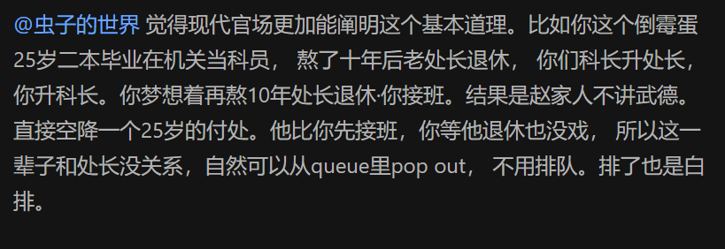

- https://oi-wiki.org/ds/stack/
- 可以用[[adapter]]实现
# 单调栈
- https://oi-wiki.org/ds/monotonous-stack/
- 栈中存的元素对应了二维平面中单调的一串点
- 一旦破坏单调性，就弹出！
- 应用
  - [[32-longest-valid-parentheses]]
  - [[1944-number-of-visible-people-in-a-queue]]
- 
  - 乐
  - 年轻和位高你至少占一样吧
## 滑动窗口最大值
- 滑动，然后要么年轻，要么值大，否则无希望
- follow up：滑动窗口最大连续下跌
  - [代码](rolling_window_max_downfall.py)