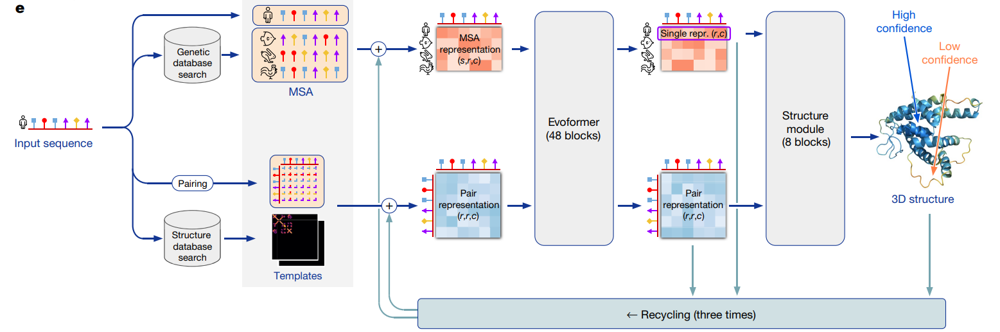
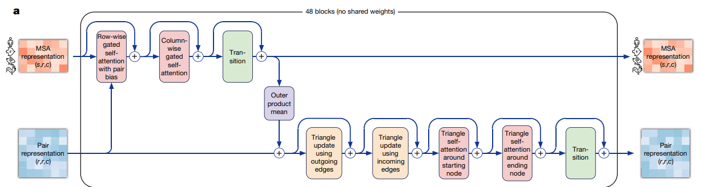
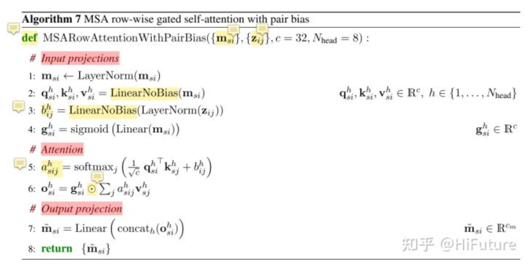
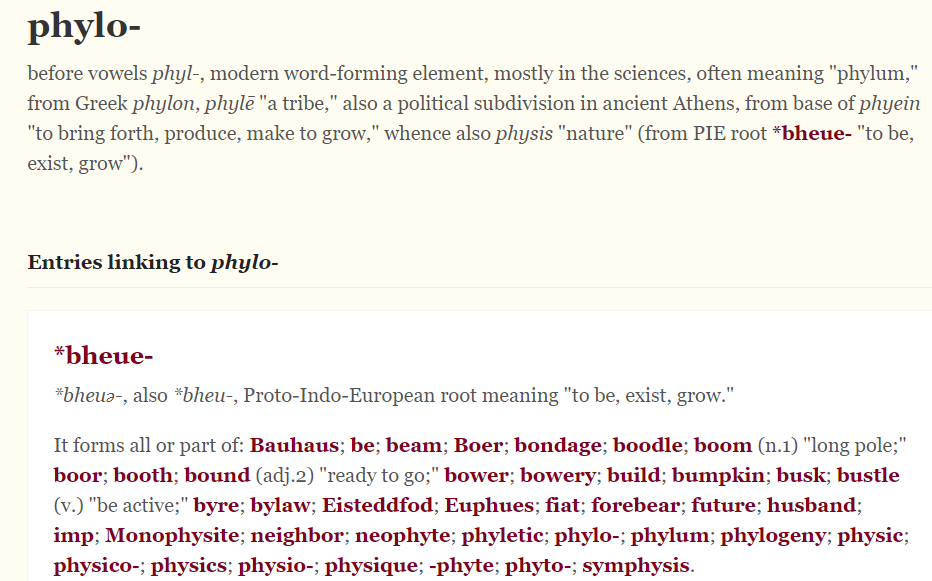
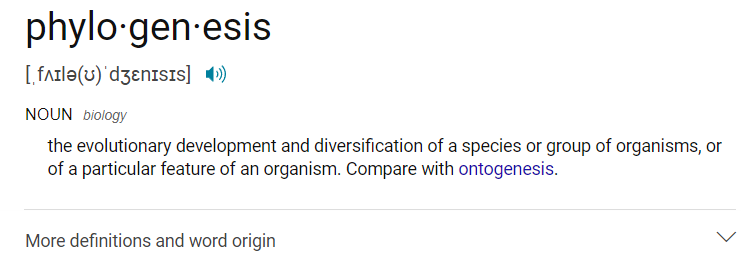
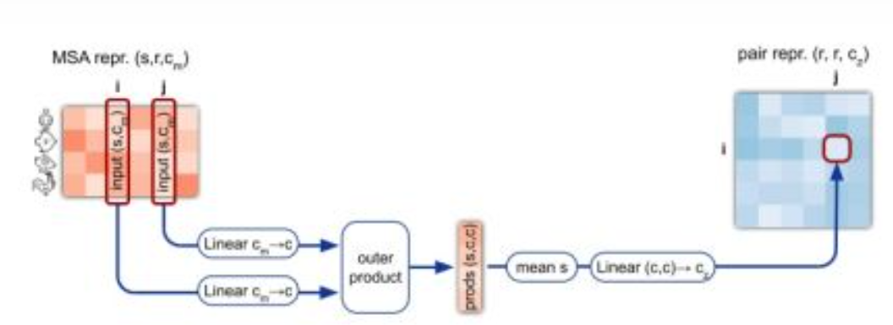
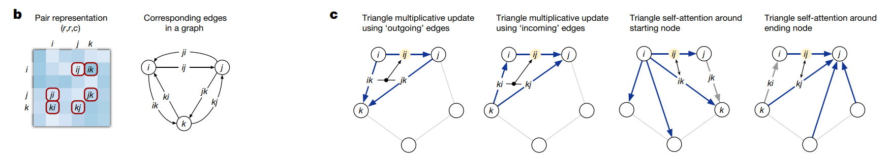
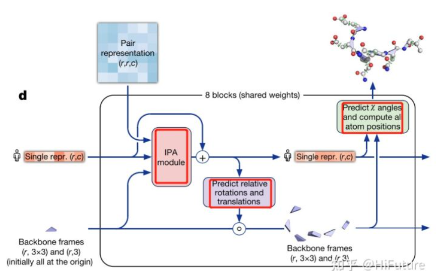
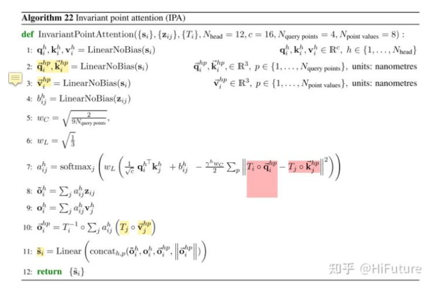
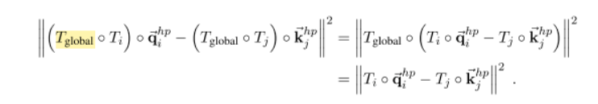

# 总述
- [原文](https://www.nature.com/articles/s41586-021-03819-2.pdf)
- 前置
  - [[alpha-fold]]
  - [[transformer]]
  - [[msa]]
- 
# 输入
- $O(k)$方面：使用[[msa]]和已有序列数据库比较，和[[alpha-fold]]类似
- $O(k^2)$方面：在已有结构数据库中search，比较，考虑单个、侧链、基团等不同scale的特征，形成pair features
# evoformer
- 
- 注意所有都是Res结构
1. row-wise类似于[[transformer]]，往上增加[[lstm]]类似的gate，以及整个矩阵形状的bias
- 
2. 列：换个方向，也是类似的
- insight: 一个方向是氨基酸间关系，一个方向是channel间关系
- 注意氨基酸间关系这个方向有利于得到 phylogenesis 相关信息
  - 
  - 
  - 这是一个学科insight（利用进化间的关联性作为先验）
3. $O(k)$ feature作MLP
4. 把两个氨基酸 (`r`, residue) 对应的信息转化成pairwise信息，核心是向量变成矩阵的所谓outer-product 
5. 对pairwise也做和刚才类似的attention，计算过程一样，但意义不同
- 根据几何意义，这个矩阵可以看作图（graph），因此这里的self-attention和“三角”关系非常密切
- 
# structure模块
- 8层，共享权重（联想[[rnn]]）
- 
1. 其中IPA意为新复合全局的变换$T_{global}$时不变，
- 
- 
2. 输出相对坐标，即$y=Rx+t$的$R, t$
3. （每一层的）最后由相对信息和已知氨基酸序列计算position
4. 折叠不是一步到位的，而是上一步折叠的结果会输入下一步IPA，逐步进行折叠