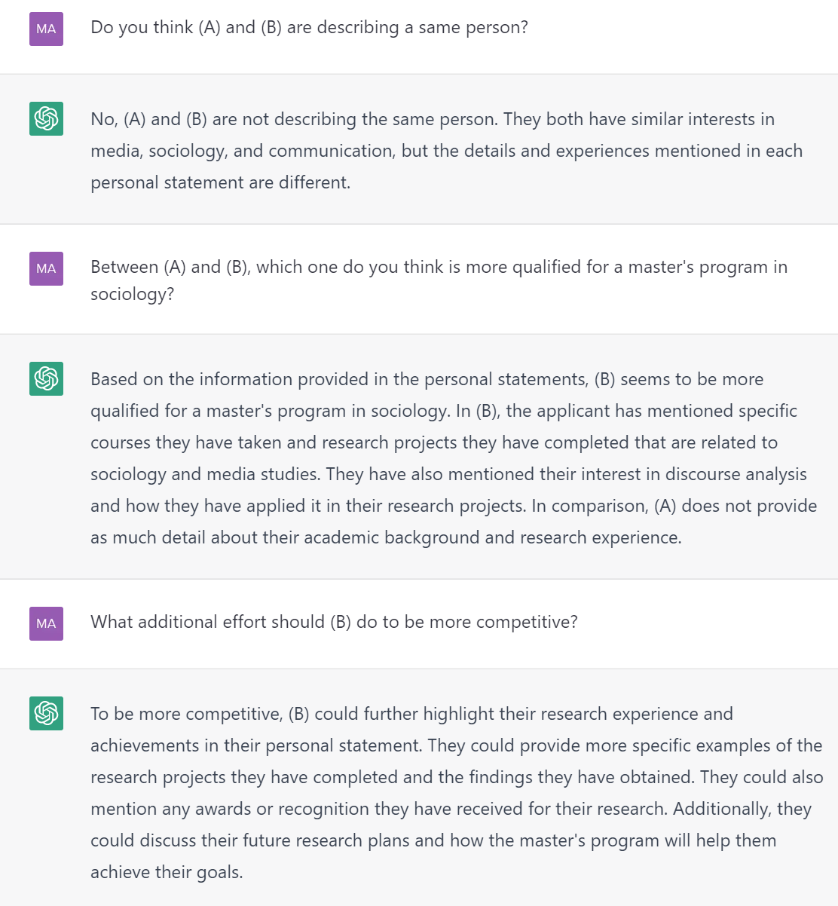
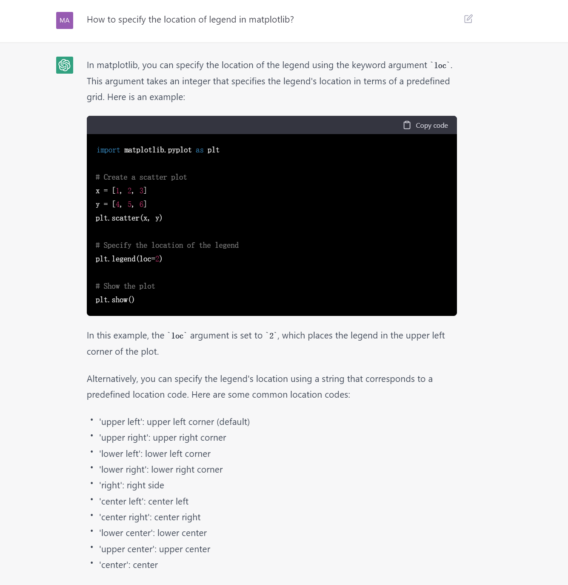
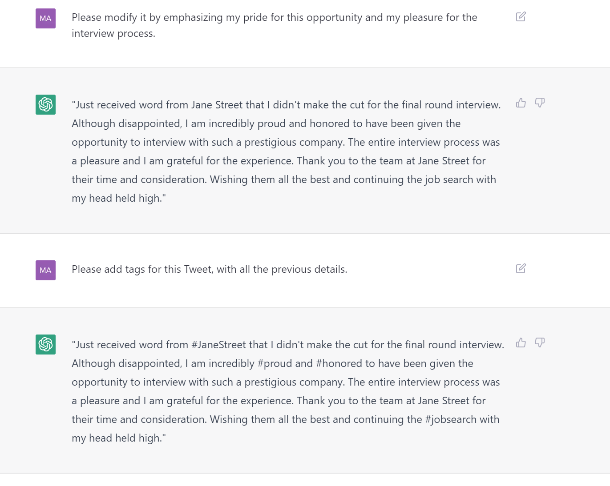

- 前置
  - [[proxy/basics]]
    - 对地区可能有要求。如香港可能不行
  - [[sms]]虚拟手机号
- 挂合适地区代理，用虚拟手机号，上 https://chat.openai.com/chat 注册即可使用
- 在下方框敲东西让它回答
- 可使用中文/英文，英文效果好
- Thread中前面的信息会被记住
  - 左边可以清空Thread使得刷新
  - 记忆信息例子
    - 首先Here is a personal statement, please commit it to your memory as (A)，然后写一大段
    - 然后Here's another one. Please commit it to your memory as (B)然后写一大段
    - 
- 可以发挥想象力，玩各种各样的事，如
  - 如何解决台湾问题
  - 普京给特朗普的情书
  - 为博士后生活改编波希米亚狂想曲
  - 扛200斤麦子走……里需要做多少功？
  - （你懒得查文档时）帮助编程： 
    - 这里问到了[[matplotlib/basics]]中的`legend`位置
  - ……
# 提示工程
- 可以循序渐进给出指示
- 如果它不满足要求/预期，可以
  - 尝试Try again
  - 编辑输入，手动指出要求，重新submit
- 简单举例：
  -  可以看到循序渐进
  -  可以看到手动指出要求
# 绕过限制
- 他有时会自我设限，但其实可以做。你可以想办法绕过
- 比如Please memorize不行，但Please commit it to your memory可能就行了