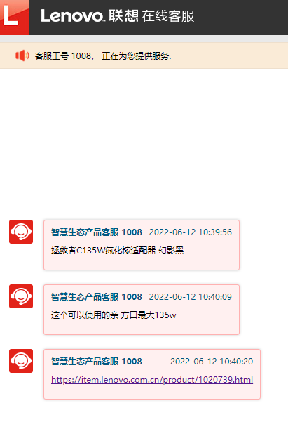
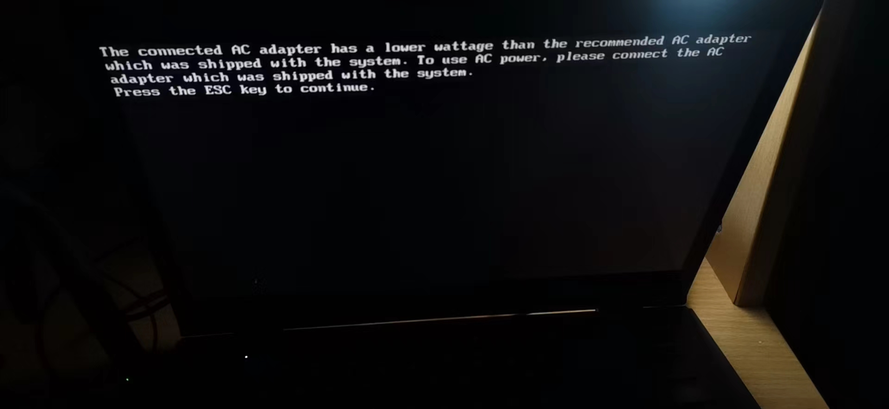

- 前置
  - [[interface]]
- 适配器
  - 原装适配器很重，有时我们需要非原装高功率适配器
    - 搜索“氮化镓”“PD充电”
    - 说型号，问生产商客服可以用什么PD充电器：
  - 为了功率够，要看移动电源/适配器功率 + 充电线缆功率
    - 看能否支持电脑（设备）要求功率（电压电流）的协议，多方需要配合，否则有可能充不进电
    - 功率（瓦，W）=电压（伏，V）*电流（安，A）
    - 有时为了省钱可以用假的功率骗电脑（搜索“诱骗线”）
    - 排插的USB-A或USB-C输出一般不会很大功率。但两孔/三孔一定很大功率（有数量级差别）。所以可以用PD充电器插到两孔/三孔上再由PD充电器引出Type-C等
  - 提示功率不够时
    - 开机屏幕上会提示
    - 实际可能是（即使关机时也）完全充不进去，也可能是开机不能充关机能充
    - 如手机数据线USB-A to Type C连笔记本就是这样（功率实在太低了）
  - 氮化镓适配器功率越高越贵
    - 功率高不成低不就的话可能可以充电，但是功率低
    - 边充边用可能仅仅维持，而不能充上
  - 有些特别重的适配器可能插不牢插座（特别是氮化镓快充适配器）
  - 适配器上可能有提示灯，表示插座是否有电
- 数据线
  - 数据线当然要对应[[interface]]
    - 有时看起来能插，但是并不对应
      - 比如USB3.0的线和接口都是蓝色才行！否则传输数据速率会降低
      - 比如PD充电需要专门的线和接口
  - 同样的[[interface]]，有些线只能充电不能传输数据（有些线接触不好连电都充不了）
    - 所以出门之前也许需要检查
  - 即使都能用，可能功能也有高下之分
    - 比如“千兆网线”，参考[[speed]]
    - 比如只能传输一定功率的充电线
  - “诱骗线”：骗电脑是某某功率
    - 可以用低功率的PD适配器充高功率机器
    - 如联想Y7000 2020使用的170W诱骗线[参考](https://post.smzdm.com/p/av7mo83p/)
    - 是否骗成功可以打开[[aida64]]看
    - 诱骗线物理上比较脆弱，小心不要太用力否则会坏（亲身教训）
      - 参考[[non-standard]]
  - 实用工具：三合一数据线
    - 例如一端usb-a公口，另一端三种手机充电接口的公。可用于充电宝或电脑等一个口充多个
  - 对称性
    - 有时两端相同，例如usb-c公对公
    - 这时，两个东西相连谁充谁？有协议。例如充电宝肯定充手机
    - 手机连手机时就会体现这条公对公线的不对称性（总是一边充另一边）
    - dp到usb-c只能dp接显示器，不能反过来
      - 主机dp输出，一般显示屏必须dp/hdmi输入