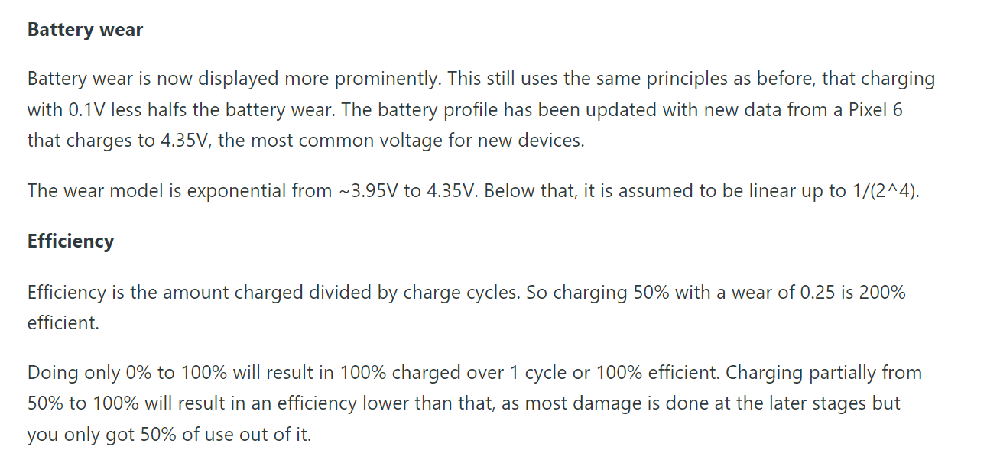
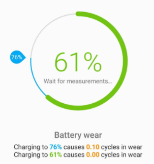

- 电池寿命损耗
  - [参考](https://zhuanlan.zhihu.com/p/71376047)
  - [参考](https://zhuanlan.zhihu.com/p/136393393)
    - 即结论：最好长期插电，但定期充放电一下
    - 所以[[sleep-hibernate]]就很有帮助了。大部分时候插电，拔电前休眠
    - 长期插电时最好维持在50%-60%，需要借助软件
  - 一些概念
    - wear level：相当于“上限”变小，全充满后，电池能使用的时间更少
    - efficiency：使用更少的电池损耗，充上更多的电量
      - 比如20% - 80%这种efficiency高
      - 80% - 100% 这种efficiency巨低
      - 所以最忌讳的就是用一点就去充，用一点就去充，频繁在高电量附近充
    - 参考资料（来自[这里](https://accubattery.zendesk.com/hc/en-us/articles/209507189-Tab-3-battery-health-screen)）
      - 
      - 举例
      - 例子中，用0.10充了15%，efficiency就是1.5
  - 深度充放电（太低电才充，然后充得太满）会损害锂电池
    - 以前老旧的镍镉电池可能反而需要深度充放电。但现在时代变了！
    - 搜索“记忆效应”
  - 电池管理方法（怎么长期保持50-60%？）
    - 手动插拔
    - 手机app如[[android/battery]]中的
    - 电脑软件和设置如[[power-options]]中的
- 省电
  - 参考[[power-options]], [[android/battery]]
  - 注意省电和延长寿命有时并不是一致的