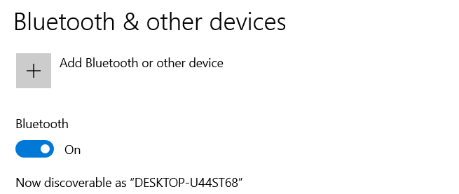

- 硬件
  - 笔记本电脑，智能手机，智能设备等自带
  - 有些电脑（如台式）可能没有，这时可以插USB蓝牙适配器
    - 适配器也有新/老很多版本。有些设备可能只能用较老的蓝牙版本，这时内置适配器如果太新就需要外部插适配器
    - 参考[[version]]
  - 内置蓝牙适配器本质也是USB设备，在[[aida64]]的USB设备管理中可看到
- 连接
  - 前提：打开蓝牙功能使得可以进行蓝牙连接
    - 例如安卓手机的下拉打开，电脑的设置，蓝牙耳机的开机等
  - 对于已经配对过的，往往打开即可自动连上
  - 对于新设备，往往需要
    - 一方打开某个“被发现”开关（可能的字眼：visibility, discoverable）
      - 例如手机、电脑设置中的开关
      - 例如耳机、音箱、手表等根据其说明书操作（比如长按电源键直至听到提示音或灯闪烁，比如长按表冠（三点方向的那个）等）
    - 另一方搜索设备
      - 例如win10的蓝牙界面：该图目前显示discoverable（能被别人发现），且按`+`可以新增设备（发现别人）
      - 
    - 点击“配对”，双方确认配对。此时可能有配对码等
- 使用
  - 蓝牙耳机听歌/打电话
  - 电脑右键“发送到”可能快速发文件给手机，不需要连线
    - 手机上需要确认
    - 这样发大文件当然很慢