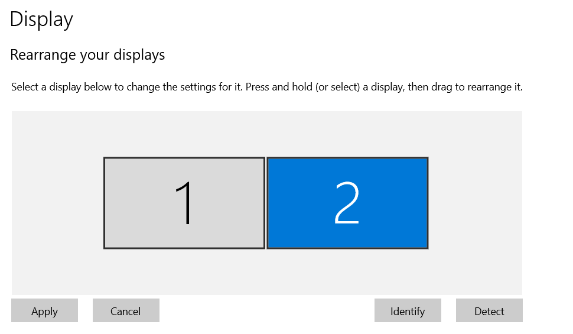
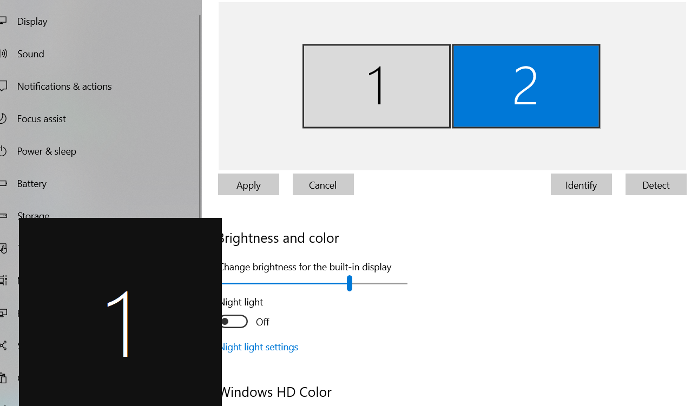

- 接显示器的接口：例如hdmi, vga等。如果笔记本上没有此接口可能需要扩展坞
- 笔记本接显示器后可以有许多模式，最常见的是"extend"
  - 各种模式的含义示例如图
  - 该界面由笔记本的某个[[fn-key]]控制。此设置优先于下一步提到的设置
- [[fn-key]]控制显示模式合适后，桌面右键`Display settings`可以做进一步设置
  - 
  - 可以选择左右或上下排列
  - 强烈建议如上图对齐否则鼠标移动时会很恼火
  - `Identify`按钮可以显示哪个屏幕是哪个：
- 在extend时，win10的**鼠标拖动窗口到边角让它自动占一半/四分之一**功能有时会比较难用
  - 比如上图中`1`的右侧边
  - 不过仔细一点鼠标拖着窗口一点点往边上靠，还是能实现此功能的，例如一点一点把鼠标从`1`屏幕的中间移到右边界，就可以成功这样
  - 
- extend时截图可以跨屏，如上图效果