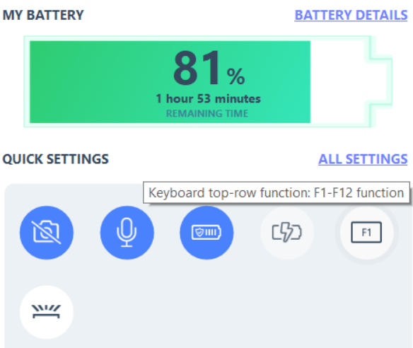

- 笔记本的`Fn`键不是一般意义的键盘键，而是和硬件密切相关，具体参考[百度百科](https://baike.baidu.com/item/Fn%E5%8A%9F%E8%83%BD%E9%94%AE)
> 操作系统并没有Fn键的概念，所以该键不能在软件中正常映射
> Fn键的功能在笔记本硬件层次上是由主板上的一个单片机控制的

- 所以很多Fn的功能，问题等都和厂商密切相关，不同厂商不通用
  - 比如联想官方驱动列表中有
  - 比如lenovo vantage
    - 开关中有便捷开关`FnLock`这种功能
    - 注：lenovo vantage是联想官方编写，和硬件密切相关的一款软件，支持调整散热模式，背光等硬件事项
- “我不想知道原理是不是硬件，只想唯象使用怎么办”
  - 比如观察到`Esc`键上也写着`FnLock`，那么`Fn + Esc`就是开关`FnLock`
  - 假设`F5`上还标记着“亮度减小”图标，那么`FnLock`开关（`Fn + Esc`）时，以下两种状态来回切换
    - 裸按`F5`刷新（或其它软件中设计给`F5`的功能），`Fn+F5`减小亮度
    - 裸按`F5`减小亮度，`Fn+F5`刷新（或其它软件中设计给`F5`的功能）