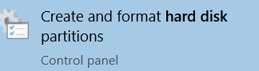
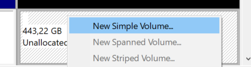
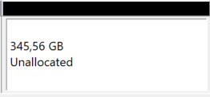
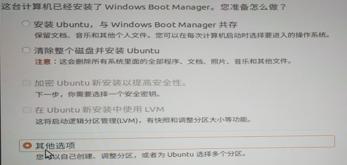

## 常用工具
- win10: 开始菜单 - 搜索hard disk - 打开
在出来的界面中可以添加、删除、压缩卷等
比如在unallocated的部分，可以添加卷
  - 局限：对于linux的那些分区只能暴力删除，无法调整
  - 无法删改[[efi]]
- win10：开始菜单 - 搜索diskpart
  - 这个是命令行，但功能更多些，比如可以删改[[efi]]
  - 参考[[efi]]
- Ubuntu: `sudo apt install gparted`, `sudo gparted`
  - 这个可以调整win的分区
  - 局限：如果不是[[u-disk-boot]]，`/`和`/home`等肯定是在用的，那么就没法unmount和调整
    - 用了[[u-disk-boot]]作为[[temp-solution]]，不正在使用`/`，就可以
  - `swap`正在用的话可以右键关闭
  - 这个相比win的，更“高层”，比如有整体移动的操作
  - 但后果是可能一个操作用时比想象的久很多（比如需要复制）
## 基本操作
- 分区成线性排列，总是占据连续部分。操作也只有有限的几个操作
  - 正因如此，分区的顺序可能造成很大麻烦，比如[恢复分区卡在中间让C盘不能扩容](https://zhuanlan.zhihu.com/p/410257023)
- “模拟操作”小游戏
  - win这边只有Extend，Shrink，Delete等少数几个操作。怎么把整个分区移动一段？
  - 比如：Shrink旧分区`E` - 新建分区（获得新盘符`G`） - 手动拷贝`E`文件到`G` - 删除`E` - 把刚刚新建`G`改成旧盘符`E`
  - 如果你硬盘上还有很多空间，当然很容易这么做。否则可能需要一个移动硬盘过渡
  - 这时说明了分区数量稍微适当多点（不要一整个硬盘只有一个区），硬盘空间留多一点是方便的
- 注意系统盘的开头不能移动，否则将导致无法boot（连[[u-disk-boot]]都可能不行）
  - 所以设置系统盘开头时需要特别注意位置，尽量靠前
## unallocated状态
- unallocated就是目前不对应任何分区
  - 比如，装双系统时，不能说**我现在弄个`E:`盘等下用来装Ubuntu**，因为这样这部分空间就被Win占用了
- 腾出unallocated的磁盘空间：
  - 如win10，要腾出成“黑色”如图
  - [[vmware/settings]]里也有提到类似的unallocated状态
- 注：双系统需求：if there're 2 hard disks:
  - for the SSD (the one with windows boot manager), leave out 200M for [[efi]]
  - for the other (HDD, "main data disk"), leave out >100G
## 装双系统时手动分区方案
- 先看[linux文件规范](https://blog.csdn.net/chenlixiao007/article/details/109152565)，根据你的需求判断哪些地方大概需要多少空间
- 
- minimal: 4 partitions
- for all, choose "from the beginning"
  - efi, primary, efi system, 200M
    - 其作用，错误的后果，删除和调整方法参考[[efi]]
  - /, primary, ext4, at least 20G
    - just like `C:\\` in windows ("system")
    - 如果你需要装很多东西到系统盘，当然就要变大
  - swap, logical, swap, 2 * RAM size
    - 中文“交换分区”，和内存有关
  - /home, logical, ext4, 100G
    - just like `Data (D:)` in windows
- 当然，也不排除外接大硬盘[[mount]]到`/opt`，`/DATA`等