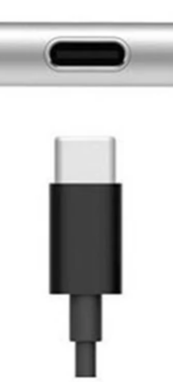

- Type C特点
  - 对称，正反插都行
  - 经常用来充电
    - 笔记本电脑可能有这种口用来接收来自移动电源的电
    - 不过这样功率可能不够。此时开机屏幕上会提示
  - 可能用来出电也可能用来入电。对于有多个Type C口的设备一定要小心哪个是入哪个是出
- USB
  - 共同特点：形状对称，但是只有一个方向能插，所以很烦……
  - 3.0接口是蓝色的。一些设备比如[[realsense/installation]]必须3.0
- HDMI
  - 不对称
  - 机箱（数据源）有多个可以插，但有些是HDMI输出有些是VGA输出。看清楚再插
  - 显示器有时也有多个可以插，编号HDMI1，HDMI2等等，可以在显示器菜单选