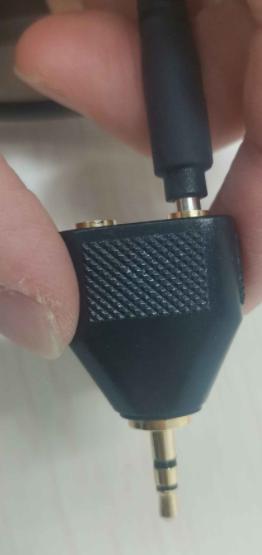
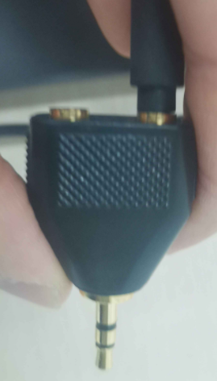
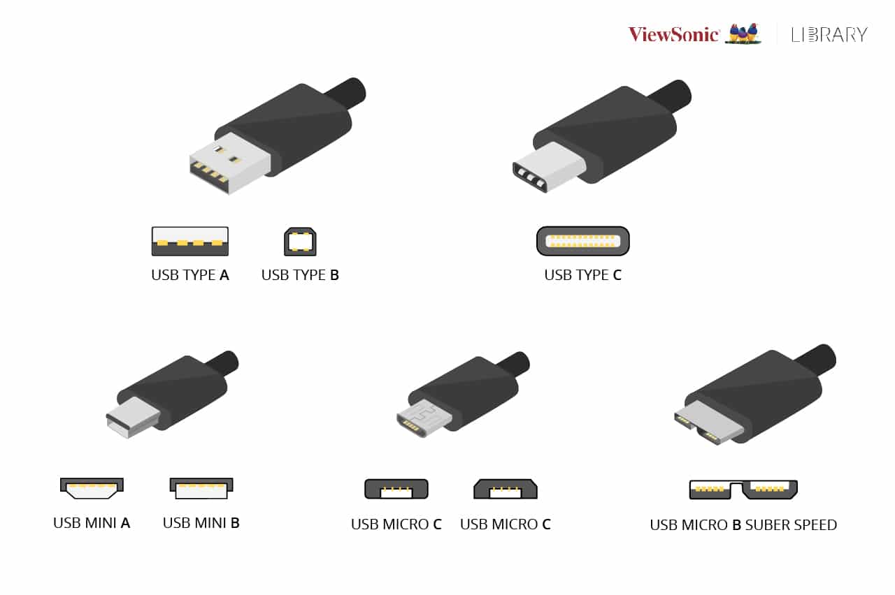
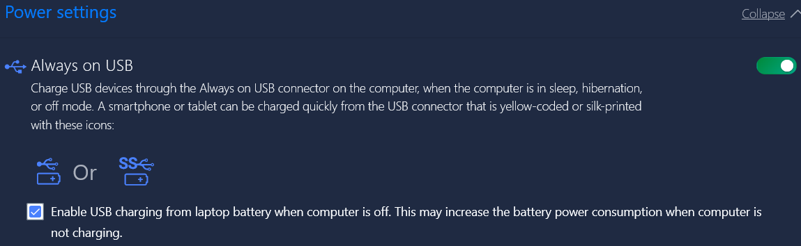

- 凹、凸分别被称为母口、公口
  - 所以买转接头搜索时经常有“母对母”字眼
- 接口不牢？
  - 可能是手机壳多了一部分厚度（比如对3.5mm耳机接口）。取下手机壳试试
  - 可能因为新的需要磨合，多插拔几次就会变好
  - 有时可能可以适当用大点力（不要过分）
    - 尤其是新插口
    - 比如这个耳机一分二
      - 温柔插，只能到这里，可以勉强用但是不牢固，时不时就单声道
      - 稍微用点力才能牢固
- USB形态汇总
  - [USB形态汇总](https://www.viewsonic.com/library/tech/usb-c-usb-b-and-usb-a-whats-the-difference/)
  - [更详细介绍](https://zhuanlan.zhihu.com/p/447595295)
    - 典型时代特征：USB mini往往相比USB micro年代更久远
    - `Micro USB接口，属于Mini USB的下一代规格接口`
  - 
- 如果笔记本没有某些种类的接口就必须用[扩展坞](https://baike.baidu.com/item/%E6%89%A9%E5%B1%95%E5%9D%9E/9493210)
  - 比如其他接口转USB-A或USB-C，然后插到对应母口中
- 能插上不一定能用
  - 例如机箱多个HDMI口只有一个能用
  - 例如Type-C口，大家都能插，但协议不同
  - 例如RJ45网口和有线电话口长得一样
- Type C（或称USB-C，USB Type C）
  - 对称，正反插都行
  - 有很多种协议
    - 口都可以插，但能不能高速传输能量/信息就看口、线等能否配合了
    - 经常用来高速充电、便携充电（PD充电）、高速传输数据
    - 用于充电时，请参考[[adapter-cable]]，确保协议能配合，功率足够！
      - 此时常见使用type c公对公线
    - 用于传输数据时，还常用于接扩展坞
  - 可能用来出电也可能用来入电。对于有多个Type C口的设备一定要小心哪个是入哪个是出
  - 比如[这个例子中](https://blog.csdn.net/Diffserv_/article/details/115211061)的type-c母口只能传输数据不能充电
- USB-A
  - 共同特点：形状对称，但是只有一个方向能插，所以很烦……
  - 3.0接口是蓝色的。一些设备比如[[realsense/installation]]必须3.0
    - 这和USB-C的“同一接口不同协议”是同一类现象
  - 一种特殊的USB-A口：关机也可给手机充电
    - 
- HDMI
  - 不对称
  - 机箱（数据源）有多个可以插，但往往只有一个真实有效，参见[[comment]]
  - 显示器有时也有多个母口可以插，编号HDMI1，HDMI2等等，可以在显示器菜单选
- 有时重新插拔接口可以解决一些问题
  - 比如有时显示器熄屏了需要重新插拔
  - [[wired-connection]]
  - [[franka-panda/troubleshooting]]
  - 重启或[[timeshift]]之类后，插在主机上的各种附属物有些可能要重新插拔，比如[[connect-controller]]和[[realsense/installation]]