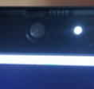

# 初印象
- 如某品牌笔记本电脑前置摄像头，如图所示

- 亮灯表示在用
# 打开隐私设置
- 一大堆地方都有设置，全部通过摄像头才能用
1. 硬件：有些品牌上面有个小开关（参考前面的实拍图），用来保护隐私用
   1. 如果不想开摄像头，就把它关掉
   2. 此时相机画面中看到现象就是一片黑且有雪花点
2. 第三方杀软，公司域安全设置等可能导致问题。请卸载第三方杀软，退公司域等
3. windows系统开始菜单搜索privacy, camera等字样看看
4. 如果是浏览器浏览网页使用摄像头，还需要浏览器给予相应网站权限
   1. 一般是网站问你，然后你按个同意按钮
   2. 举例：[测试摄像头网址](https://webcamtests.com/)