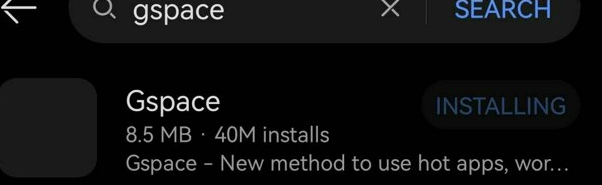

- 前置
  - [[google]] [[account]]
  - [[region-language]]
- 由于众所周知的原因，华为手机无法用google服务，从而无法装一些app
- 法一：gspace
  - AppGallery应用商店改变地区
  - 搜索下载GSpace
  - 
- 法二：[[workaround]]
  - 使用apkpure等第三方下载app并安装，参考[[download-resource]]
  - 绕过了问题，没有根本解决问题，因为还是不能用[[google-play]]，如果有的应用必须要，就傻了