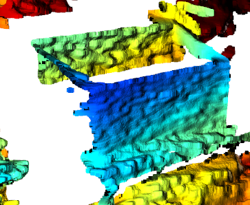

前置：
- 操作参见[[python-wrapper]]
- 需要光线足够、需要材质比较多漫反射比较少镜面反射
  - 比如印刷品（手机壳、布艺收纳箱、纸箱）、漫反射显示屏效果非常好
    - ，露出的部分拍出来的都不错
    - 贴透明胶不影响（可能是因为透明，所以该漫反射还是很多漫反射）
  - 光滑塑料箱效果差（很多破洞）
- 抖动会降低质量
- 拍摄角度影响质量。所以涉及相机[[hand-eye-calibration]]时要先确认该角度点云质量可以再进行标定

- 注：[[realsense/installation]]的`realsense-viewer`窗口中，通过打开开关看到点云预览，可以鼠标旋转，也可以右上角导出`.ply`，出来的效果比`open3d`更好（可能是因为intel的算法工程师）